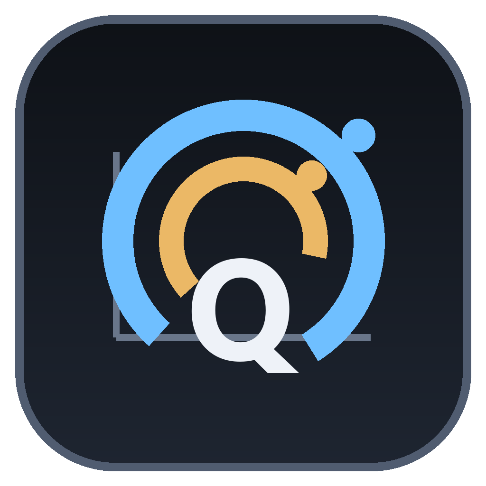
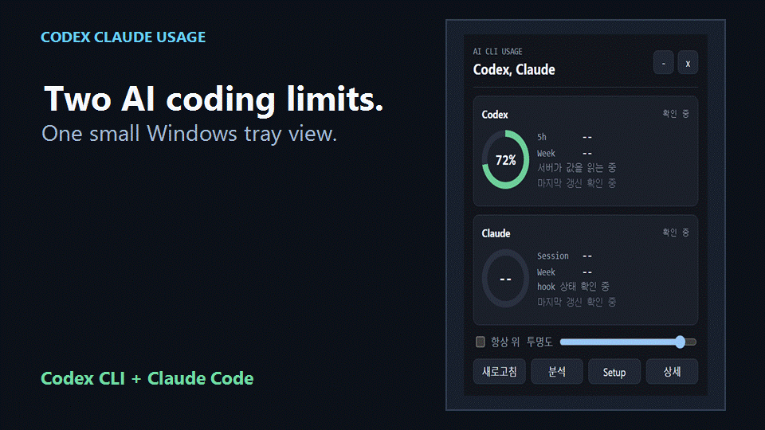
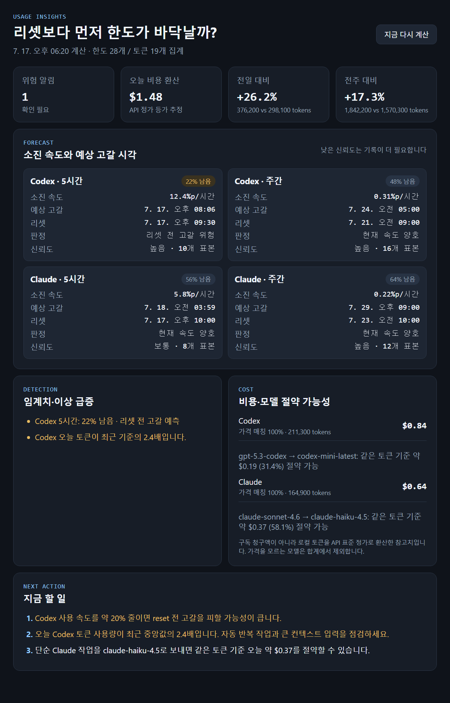
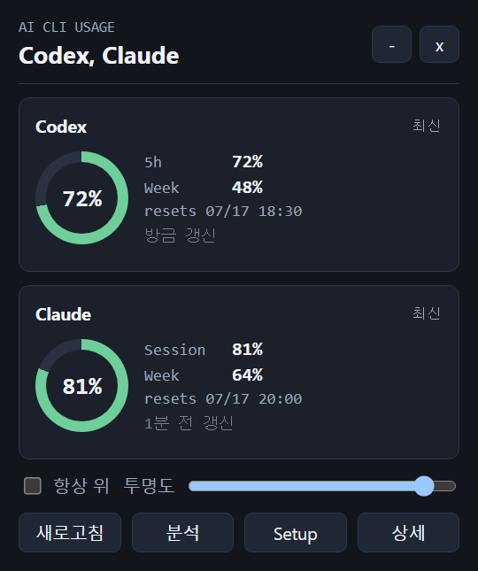
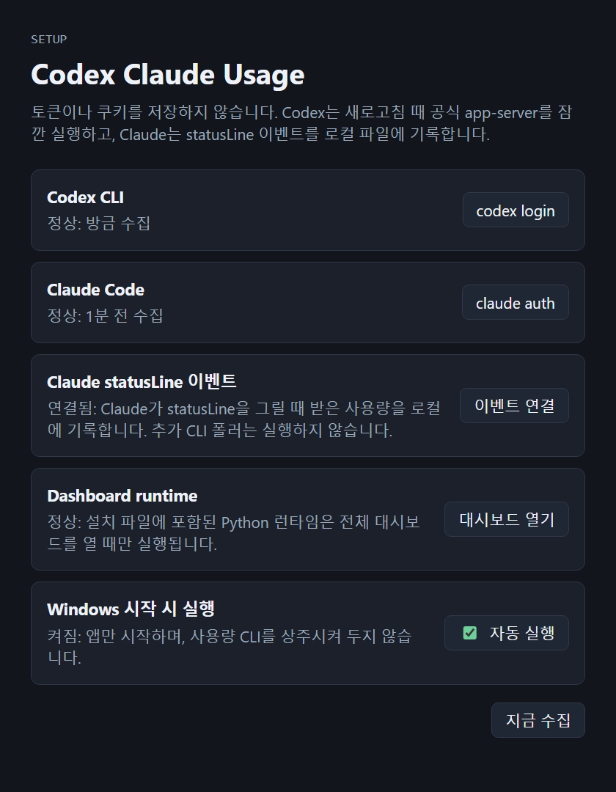
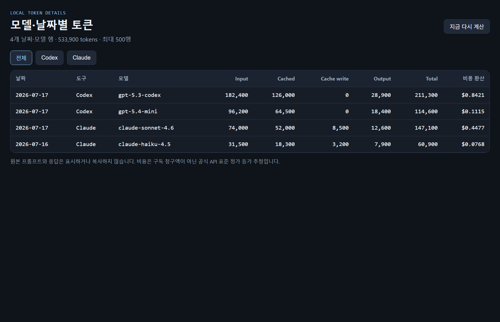
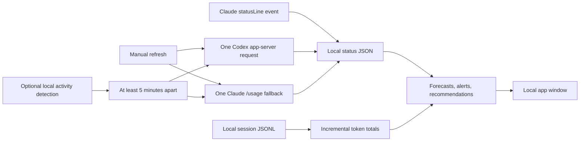

<p align="center">
  
</p>

<h1 align="center">Codex Claude Usage</h1>

<p align="center">
  <strong>Know whether your Codex or Claude Code limit will run out before it resets.</strong><br>
  A local Windows tray app that forecasts quota exhaustion, detects unusual usage spikes, and recommends what to change next.
</p>

<p align="center">
  <a href="https://github.com/Kyuhan1230/ai-usage-monitor/releases/latest"><strong>Download for Windows</strong></a>
  · <a href="docs/README.ko.md">한국어 문서</a>
  · <a href="#installation-and-trust">Installation & trust</a>
  · <a href="https://github.com/Kyuhan1230/ai-usage-monitor/discussions">Give feedback</a>
</p>

<p align="center">
  <a href="https://github.com/Kyuhan1230/ai-usage-monitor/actions/workflows/ci.yml"></a>
  <a href="https://github.com/Kyuhan1230/ai-usage-monitor/releases/latest"></a>
  <a href="LICENSE"></a>
  
</p>

<p align="center">
  
</p>

<p align="center">
  <a href="docs/images/walkthrough-45s.mp4">Watch the 45-second walkthrough</a>
</p>

This is not another generic token dashboard. It is built for heavy Windows users of **Codex CLI** and **Claude Code** who need to decide:

- Will this quota run out before its reset?
- Is today's usage unusually high?
- How much should I slow down?
- Would switching models help?

The app processes usage locally. There is no developer-operated analytics server, advertising, or remote usage telemetry.

## What you get

| Forecast | Detect | Act |
| --- | --- | --- |
| Estimated exhaustion time, reset comparison, and confidence | Quota and token spikes relative to your own recent baseline | Required slowdown, repetitive-work checks, and lower-cost model suggestions |

<p align="center">
  
</p>

## Installation and trust

1. Download `Codex-Claude-Usage-Setup-<version>.exe` from the [latest GitHub Release](https://github.com/Kyuhan1230/ai-usage-monitor/releases/latest).
2. Compare its SHA-256 digest with the digest shown on the Release page.
3. Run the installer. The first launch opens Setup, where either Codex CLI or Claude Code is enough to begin.
4. Sign in through the tool's own CLI, then select **Check status again → Finish setup**.

> [!WARNING]
> The current Windows installer is **not Authenticode-signed**. The SignPath Foundation application was not approved on 2026-07-23 because the project does not yet have enough external adoption and independent references. Windows SmartScreen may therefore show **Unknown publisher**. This status is disclosed rather than hidden.

The in-app updater uses a separate Tauri cryptographic signature and refuses files that fail verification. That protects update integrity, but it does not create a trusted Windows publisher identity.

Before running an unsigned beta:

- Download only from this repository's [GitHub Releases](https://github.com/Kyuhan1230/ai-usage-monitor/releases).
- Verify the SHA-256 digest published by GitHub and repeated in the release notes.
- Review the [privacy policy](docs/PRIVACY.md), [security policy](SECURITY.md), and [code-signing policy](docs/CODE_SIGNING_POLICY.md).
- If you prefer not to run an unsigned binary, [build from source](#build-from-source) or wait for a future signed release.

The installer does not bundle Codex CLI or Claude Code. In interactive mode it can offer to run each provider's official installer only after separate opt-in confirmation. It does not download WebView2 automatically.

## Privacy boundary

- Reads quota numbers through installed, already authenticated CLIs.
- Reads new token counts from local Codex and Claude session JSONL files.
- Does **not** store authentication tokens, browser cookies, prompts, or response text.
- Stores status, settings, history, and derived analytics under `~/.codex-usage-wrapper`.
- Opens no local HTTP server or listening port.
- Runs no always-on collection CLI; refreshes are manual or activity-triggered with a minimum five-minute interval.
- Contacts GitHub Releases to check for updates. Provider network requests are made by the respective CLIs.

See [PRIVACY.md](docs/PRIVACY.md) for the complete data and network inventory.

## Screens

<table>
  <tr>
    <th width="40%">Compact view</th>
    <th width="60%">Setup and health</th>
  </tr>
  <tr>
    <td align="center"></td>
    <td align="center"></td>
  </tr>
  <tr>
    <td>See remaining quota, reset time, and connection status in a small window.</td>
    <td>Check CLI login, Claude events, local details, and Windows startup behavior.</td>
  </tr>
</table>

<details>
<summary><strong>Local token details</strong></summary>

<p align="center">
  
</p>

</details>

The screenshots use representative sample data and do not contain personal sessions or local usage.

## How it differs

The product is deliberately narrow: a Windows decision surface for two AI coding tools.

| Question | Answer shown by the app |
| --- | --- |
| Will I run out before reset? | Observed burn rate, forecast range, and confidence |
| Why did usage suddenly accelerate? | Quota and token spike detection against your recent median |
| Did I use more than usual? | Yesterday and previous-seven-day comparisons |
| What should I change now? | Slowdown percentage, repetitive-work review, and model-switch suggestion |
| Where does my data go? | Local files and local app windows; no product telemetry |

Tools such as [ccusage](https://github.com/ryoppippi/ccusage) are better when broad provider support, terminal automation, or JSON output is the priority. Codex Claude Usage instead connects Codex and Claude quotas with forecasting and action recommendations in a Windows tray app.

## Measured footprint

Reference measurements from the 2026-07-18 Windows release build:

| State | Result |
| --- | --- |
| Application executable | 4.41 MB |
| NSIS installer | 1.47 MB |
| Cold tray idle | 11.43 MB; one app process; no WebView |
| Tray idle after closing UI | 25.28 MB; one app process; measured CPU 0%; no WebView |
| Compact UI open | 427.05 MB; app plus seven system WebView2 processes |
| All idle states | No Codex/Claude CLI process; no listening network port |

The open-UI number is intentionally disclosed: WebView2 is expensive while a window exists. The app therefore creates a WebView only when a tray window is opened and destroys it when the window closes.

## How it works



Codex collection requests only `account/rateLimits/read` from the installed CLI's app server. Claude uses `statusLine` events and a one-shot `/usage` fallback when an initial value is needed. Session readers aggregate token numbers incrementally without copying prompt or response bodies into analytics.

For the design rationale, formulas, confidence thresholds, anomaly rules, WebView lifecycle, and unsigned-beta tradeoffs, read [Building a Windows quota forecaster for Codex CLI and Claude Code](docs/ENGINEERING_STORY.md).

## Build from source

Requirements:

- Windows 10 or later
- Node.js 22.12 or later
- Rust stable MSVC toolchain
- Microsoft C++ Build Tools and WebView2

```powershell
git clone https://github.com/Kyuhan1230/ai-usage-monitor.git
cd ai-usage-monitor
npm ci
npm test
npm run app
npm run dist
```

The NSIS installer is written to `src-tauri/target/release/bundle/nsis/`.

## Current limitations

- Windows only.
- Codex collection depends on account-method support in the installed Codex CLI.
- Claude's one-shot fallback depends on the current `/usage` output format.
- Cost is a list-price API equivalent, not the user's subscription bill.
- Subscription tier and exact credits are not inferred.
- Public installers are currently unsigned with Authenticode.

## Feedback and contributing

Early beta feedback is especially useful for installation failures, CLI compatibility, forecast usefulness, and SmartScreen drop-off.

- [Share beta feedback](https://github.com/Kyuhan1230/ai-usage-monitor/issues/new?template=beta_feedback.yml)
- [Report a bug](https://github.com/Kyuhan1230/ai-usage-monitor/issues/new?template=bug_report.yml)
- [Request a feature](https://github.com/Kyuhan1230/ai-usage-monitor/issues/new?template=feature_request.yml)
- [Read the contribution guide](CONTRIBUTING.md)

Do not attach raw session JSONL, authentication data, or unredacted home-directory paths.

## License

[MIT License](LICENSE) · Copyright © 2026 kyuhan1230

This is an independent project and is not affiliated with or endorsed by OpenAI or Anthropic. OpenAI, Codex, Anthropic, and Claude names and marks belong to their respective owners.
