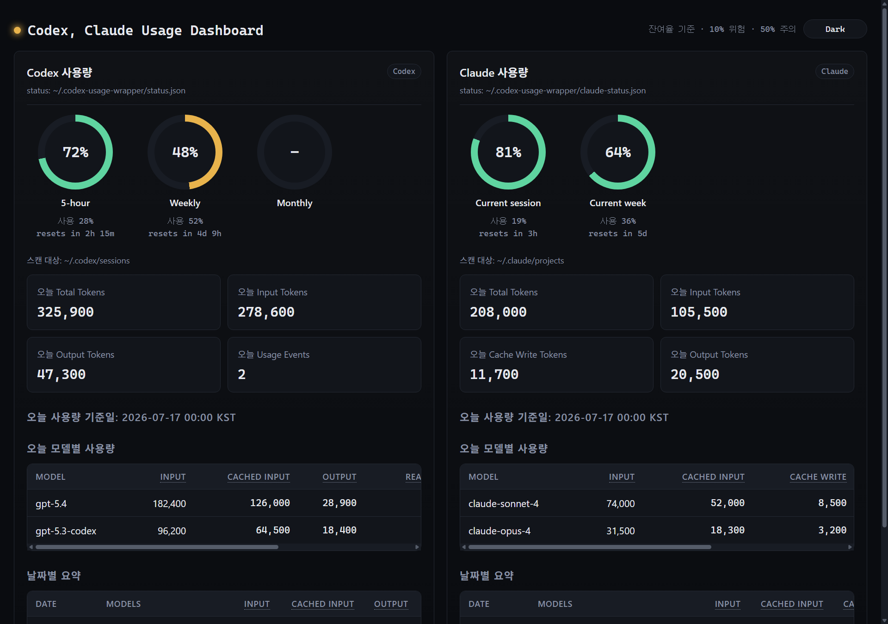
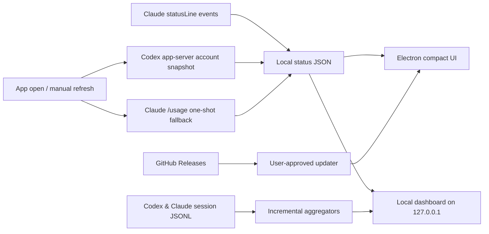

<p align="center">
  
</p>

<h1 align="center">Codex Claude Usage</h1>

<p align="center">
  Codex CLI와 Claude Code의 한도·토큰 사용량을 한곳에서 확인하는<br>
  로컬 우선 Windows 데스크톱 모니터입니다.
</p>

<p align="center">
  <a href="https://github.com/Kyuhan1230/ai-usage-monitor/actions/workflows/ci.yml"></a>
  <a href="https://github.com/Kyuhan1230/ai-usage-monitor/releases/latest"></a>
  <a href="LICENSE"></a>
  
  <a href="https://github.com/Kyuhan1230/ai-usage-monitor/releases"></a>
</p>

<p align="center">
  <a href="https://github.com/Kyuhan1230/ai-usage-monitor/releases/latest"><strong>Windows용 다운로드</strong></a>
  · <a href="#screenshots">Screenshots</a>
  · <a href="#quick-start">Quick start</a>
  · <a href="#development">Development</a>
  · <a href="CONTRIBUTING.md">Contributing</a>
</p>

---

Codex Claude Usage는 이미 로그인된 CLI가 제공하는 공식 로컬 인터페이스와 사용자 PC의 세션 로그만 읽습니다. OpenAI·Anthropic 인증 토큰, 브라우저 쿠키 또는 비공개 Usage API를 사용하지 않으며, 집계 데이터는 외부 서버로 전송하지 않습니다.

> [!IMPORTANT]
> 이 프로젝트는 OpenAI 또는 Anthropic의 공식 제품이 아닙니다. OpenAI, Codex, Anthropic, Claude의 이름과 표장은 각 권리자의 자산입니다.

## Screenshots

### Full dashboard

<p align="center">
  
</p>

<table>
  <tr>
    <th width="40%">Compact monitor</th>
    <th width="60%">Setup &amp; health checks</th>
  </tr>
  <tr>
    <td align="center"></td>
    <td align="center"></td>
  </tr>
  <tr>
    <td>남은 한도, 갱신 시각, 연결 상태를 작은 창에서 확인합니다.</td>
    <td>CLI 로그인, Claude hook, 대시보드 런타임, 자동 실행 상태를 점검합니다.</td>
  </tr>
</table>

> [!NOTE]
> 스크린샷은 실제 앱 UI를 대표 샘플 데이터로 렌더링한 것입니다. `npm run docs:screenshots`로 같은 화면을 다시 만들 수 있습니다.

## Features

| 영역 | 제공 기능 |
| --- | --- |
| 한도 모니터링 | Codex 5-hour/weekly, Claude current session/current week 잔여율 |
| 가벼운 수집 | 앱 시작과 수동 새로고침 때만 CLI를 짧게 실행하고, 평소에는 숨은 폴러를 두지 않음 |
| 사용량 분석 | 날짜별·모델별 input, cached input, output, reasoning token 집계 |
| 데스크톱 앱 | Windows 트레이 상주, always-on-top, 투명도 조절, 로그인 시 자동 실행 |
| 상태 점검 | Codex/Claude CLI, Claude statusLine hook, bundled Python runtime 확인 |
| 로컬 대시보드 | 필요할 때만 `127.0.0.1`에 FastAPI 대시보드를 실행 |
| 자동 업데이트 | GitHub Releases에서 새 버전을 확인하고 사용자 동의 후 설치 |
| 빠른 집계 | 파일별 `(mtime, size)` 캐시로 변경된 세션 로그만 다시 처리 |
| 재현 가능한 배포 | GitHub Actions 테스트, Windows 빌드, Release asset 검증 |

## Quick start

### 1. 설치

[Latest Release](https://github.com/Kyuhan1230/ai-usage-monitor/releases/latest)에서 `Codex-Claude-Usage-Setup-<version>.exe`를 내려받아 실행합니다.

설치본에는 Electron 앱과 대시보드용 Python 런타임이 포함됩니다. 별도의 Node.js 또는 Python 설치는 필요하지 않습니다.

> [!WARNING]
> SignPath Foundation 코드 서명은 심사 대기 중입니다. 승인 전 설치 파일에서는 Windows SmartScreen의 `알 수 없는 게시자` 안내가 표시될 수 있습니다. 공개된 소스와 GitHub Actions 빌드 기록을 함께 확인할 수 있습니다.

### 2. CLI 로그인

Codex CLI와 Claude Code는 각각 설치하고 먼저 로그인해야 합니다.

```powershell
codex login
claude auth
```

Claude Code 버전에 따라 `claude auth` 대신 `claude login`을 사용할 수 있습니다.

### 3. 실행

시작 메뉴 또는 바탕화면에서 **Codex Claude Usage**를 실행합니다. 창을 닫아도 트레이에서 최근 상태를 볼 수 있지만, 숨은 CLI 폴러를 계속 실행하지는 않습니다. 완전히 종료하려면 트레이 메뉴의 **종료**를 선택합니다.

## How it works



- Codex 상태는 앱을 열거나 새로고침할 때 공식 app-server의 계정 한도 메서드를 한 번 호출하고 즉시 종료합니다.
- Claude 상태는 Claude가 그리는 statusLine 이벤트로 갱신합니다. 앱 시작과 수동 새로고침 때의 `claude /usage`는 초기값을 위한 원샷 대체 경로입니다.
- 기본 앱 경로에는 1분 폴링, PID 감시, 수집 프로세스 자동 재시작이 없습니다.
- 상세 토큰 사용량은 `~/.codex/sessions`와 `~/.claude/projects`의 JSONL을 로컬에서 집계합니다.
- 전체 대시보드는 버튼을 눌렀을 때만 `http://127.0.0.1:8767`에서 시작합니다.

### Local data flow

| 데이터 | 기본 위치 |
| --- | --- |
| Codex 최신 상태 | `~/.codex-usage-wrapper/status.json` |
| Claude 최신 상태 | `~/.codex-usage-wrapper/claude-status.json` |
| 캡처 히스토리 | `~/.codex-usage-wrapper/history/YYYY-MM-DD.jsonl` |
| 대시보드 로그 | `~/.codex-usage-wrapper/dashboard*.log` |

## Automatic updates

설치된 앱은 다음 시점에 GitHub Releases의 새 버전을 확인합니다.

- 앱 시작 15초 후
- 실행 중 6시간마다
- 트레이 메뉴의 **Check for updates...** 선택 시

새 버전이 있으면 다운로드 전과 재시작 설치 전에 각각 사용자에게 확인합니다. 개발 모드인 `npm run app`에서는 자동 업데이트가 실행되지 않습니다.

## CI/CD

| 이벤트 | GitHub Actions 동작 |
| --- | --- |
| Pull request / `main` push | 전체 테스트, bundled runtime 준비, Windows NSIS 빌드, artifact 보관 |
| `v<package-version>` 태그 | 태그/버전 검증, 설치 파일 빌드, updater metadata 검증, GitHub Release 공개 |
| SignPath 설정 완료 후 | 앱과 설치 파일 서명, 서명된 최종 파일 기준 `.blockmap`과 `latest.yml` 재생성 |

릴리스 태그와 `package.json` 버전이 다르거나, 원격 asset이 로컬 결과와 일치하지 않으면 공개 단계가 중단됩니다.

## Development

### Requirements

- Windows 10 이상
- Node.js 22.12 이상
- Python 3.13
- Codex CLI 및 Claude Code

### Run from source

```powershell
git clone https://github.com/Kyuhan1230/ai-usage-monitor.git
cd ai-usage-monitor
npm ci
python -m pip install -r requirements.txt
npm run app
```

대시보드만 실행하려면 다음 명령을 사용합니다.

```powershell
npm run dashboard
```

### Test and build

```powershell
npm test
npm run dist
```

주요 빌드 결과:

```text
dist/Codex-Claude-Usage-Setup-<version>.exe
dist/Codex-Claude-Usage-Setup-<version>.exe.blockmap
dist/latest.yml
```

최초 빌드는 공식 CPython 3.13 embeddable 배포본을 내려받아 SHA-256을 검증하고 FastAPI 런타임을 구성하므로 네트워크 연결이 필요합니다.

### Refresh README screenshots

```powershell
npm run docs:screenshots
```

이 명령은 실제 Electron renderer와 Python 대시보드를 샘플 데이터로 실행해 `docs/images/`의 세 이미지를 갱신합니다. 개인 세션이나 로컬 사용량은 읽지 않습니다.

## Project layout

```text
.github/workflows/        CI와 Release workflow
assets/                   Windows 앱 아이콘
docs/images/              README용 재현 가능한 UI 스크린샷
scripts/                  runtime 준비, 패키징, 문서 캡처 도구
src/electron/             Electron main, preload, compact/setup UI
src/node/                 Codex/Claude 원샷 수집기, 이벤트 hook, 상태 파서
src/python/               FastAPI 대시보드와 JSONL 집계
tests/                    JavaScript/Python 통합 테스트
```

## Privacy & security

이 프로젝트는 다음 정보를 읽거나 전송하지 않습니다.

- OpenAI 또는 Anthropic 인증 토큰
- 브라우저 쿠키
- 비공개 Usage API 응답
- 원본 세션 로그의 외부 업로드

버그를 신고할 때 `~/.codex-usage-wrapper` 또는 세션 JSONL 원본을 공개 이슈에 첨부하지 마세요. 보안 취약점은 [Security Policy](SECURITY.md)의 비공개 신고 절차를 이용해 주세요.

- [Privacy policy](docs/PRIVACY.md)
- [Security policy](SECURITY.md)
- [Code signing policy](docs/CODE_SIGNING_POLICY.md)
- [Third-party notices](THIRD_PARTY_NOTICES.md)

## Troubleshooting

<details>
<summary><strong>Codex 또는 Claude 값이 오래됨으로 표시됩니다.</strong></summary>

1. Setup에서 해당 CLI와 로그인 상태를 확인합니다.
2. **새로고침**을 눌러 원샷 수집 결과를 확인합니다.
3. Claude는 statusLine 이벤트 연결 상태를 확인합니다.
4. 계속되면 `~/.codex-usage-wrapper/*-status.json` 수정 시각과 대시보드 로그를 확인합니다.

</details>

<details>
<summary><strong>Dashboard 버튼을 눌러도 열리지 않습니다.</strong></summary>

- 설치본은 최신 Release로 다시 설치합니다.
- 개발 환경은 `python -m pip install -r requirements.txt` 후 `npm run dashboard`를 확인합니다.
- `http://127.0.0.1:8767`이 다른 프로그램에서 사용 중인지 확인합니다.

</details>

<details>
<summary><strong>작업표시줄 아이콘이 이전 아이콘입니다.</strong></summary>

기존 고정을 해제한 뒤 최신 설치본으로 다시 고정합니다. Windows 아이콘 캐시 때문에 반영이 잠시 늦을 수 있습니다.

</details>

## Contributing

버그 리포트, 기능 제안, 문서 개선과 코드 기여를 환영합니다.

- [기여 가이드](CONTRIBUTING.md)
- [버그 신고](https://github.com/Kyuhan1230/ai-usage-monitor/issues/new?template=bug_report.yml)
- [기능 제안](https://github.com/Kyuhan1230/ai-usage-monitor/issues/new?template=feature_request.yml)

## Current limitations

- Codex 수집은 설치된 CLI의 app-server 계정 메서드 지원 여부에 의존합니다.
- Claude의 수동 원샷 대체 경로는 `/usage` 출력 포맷에 의존합니다.
- 각 서비스의 정확한 요금제 이름은 자동 판별하지 않습니다.
- Codex CLI 또는 Claude Code가 없거나 로그인되지 않은 PC에서는 해당 도구의 사용량을 수집할 수 없습니다.
- 현재 공개 설치 파일은 SignPath Foundation 승인 전까지 Authenticode 미서명 상태입니다.

## License

[MIT License](LICENSE) · Copyright © 2026 kyuhan1230

Free code signing provided by [SignPath.io](https://signpath.io/), certificate by [SignPath Foundation](https://signpath.org/). Application submitted; approval is pending.
