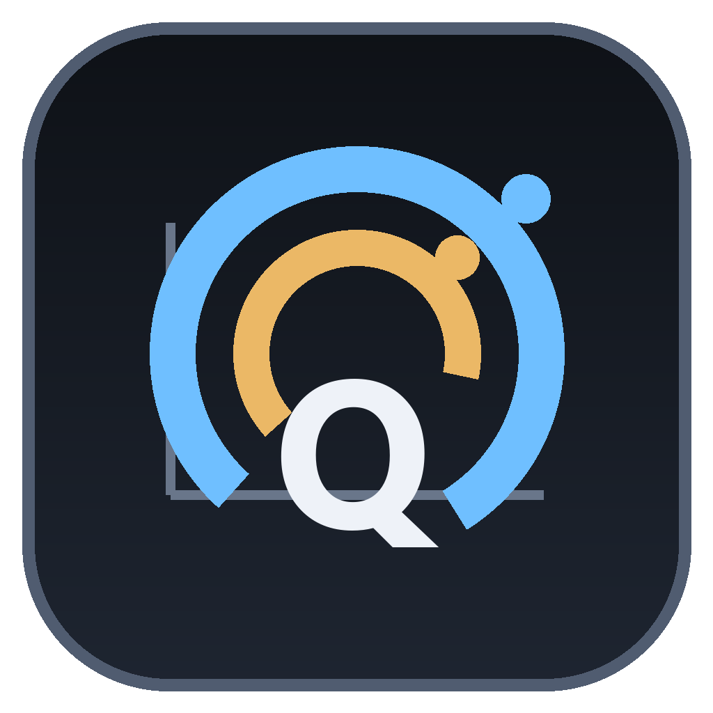
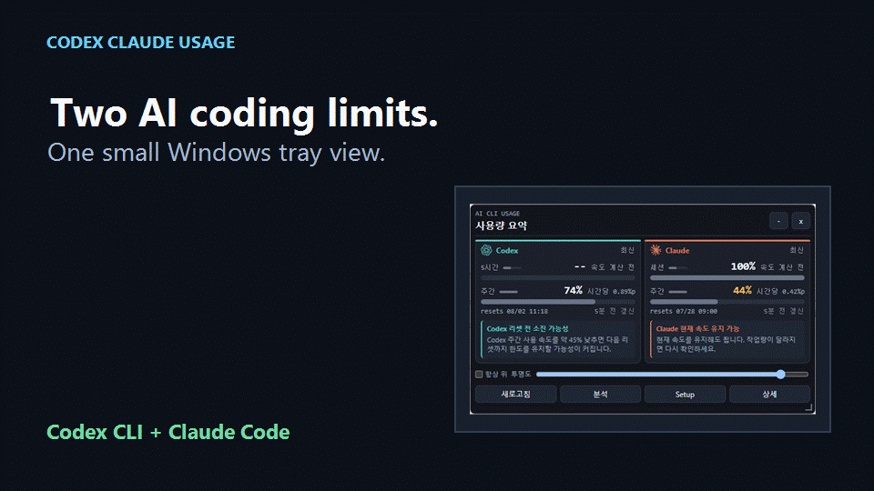
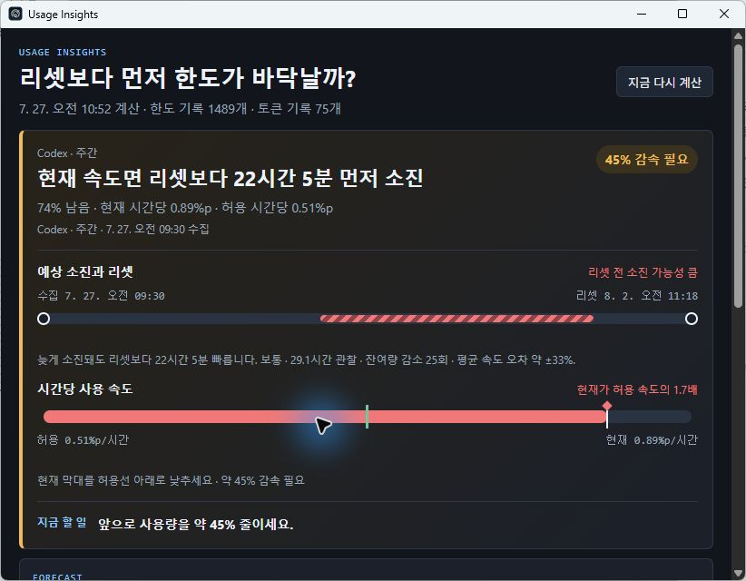
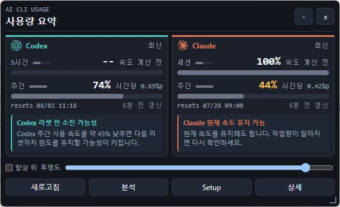
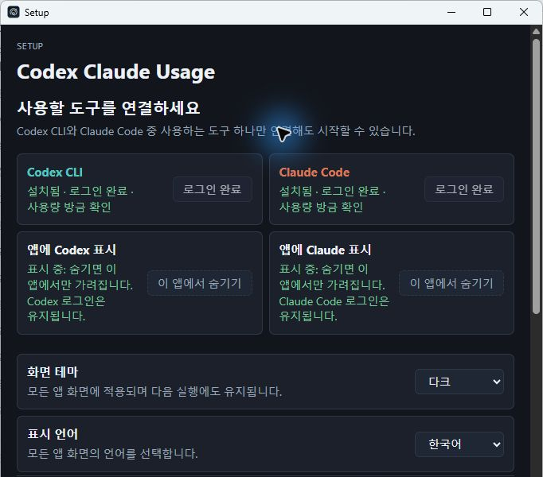
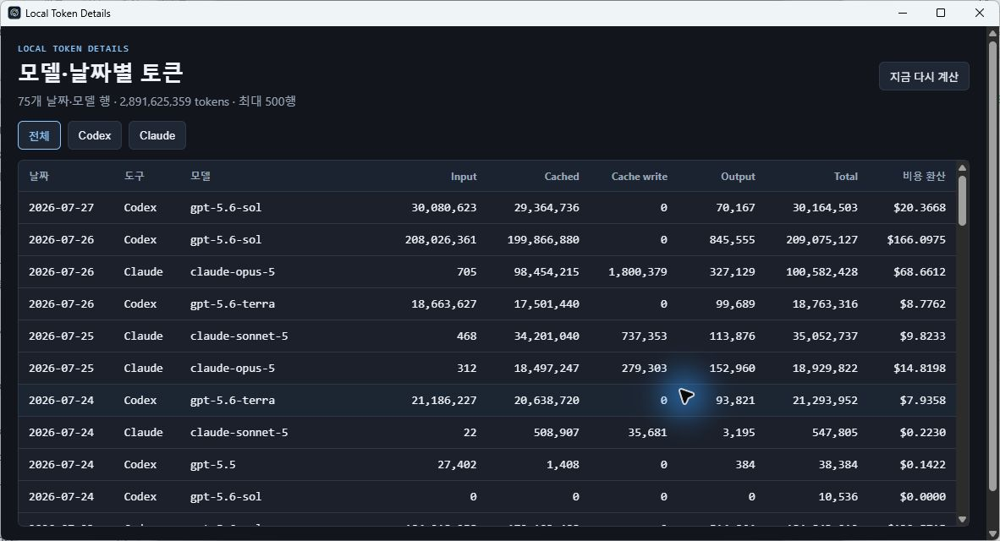
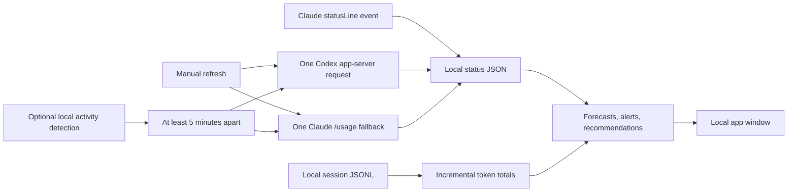

<p align="center">
  
</p>

<h1 align="center">Codex Claude Usage</h1>

<p align="center">
  <strong>Keep Codex CLI and Claude Code usage limits visible on Windows.</strong><br>
  See remaining quota and reset times at a glance, then get a cautious exhaustion forecast after enough local history exists.
</p>

<p align="center">
  <a href="https://github.com/Kyuhan1230/ai-usage-monitor/releases/latest/download/Codex-Claude-Usage-Setup.exe"><strong>Download for Windows</strong></a>
  · <a href="docs/README.ko.md">한국어 문서</a>
  · <a href="docs/CODEX_USAGE_LIMIT_WINDOWS.md">Codex usage-limit guide</a>
  · <a href="#installation-and-trust">Installation & trust</a>
  · <a href="https://github.com/Kyuhan1230/ai-usage-monitor/discussions">Give feedback</a>
</p>

<p align="center">
  <a href="https://github.com/Kyuhan1230/ai-usage-monitor/actions/workflows/ci.yml"></a>
  <a href="https://github.com/Kyuhan1230/ai-usage-monitor/releases/latest"></a>
  <a href="LICENSE"></a>
  
</p>

<p align="center">
  
</p>

<p align="center">
  <a href="docs/images/walkthrough-45s.mp4">Watch the 45-second walkthrough</a>
</p>

Codex already provides `/usage`, `/status`, and `/statusline` for checking limits inside the terminal. Use those official commands if occasional checks are enough.

This app is for heavy Windows users of **Codex CLI**, **Claude Code**, or both who want to know:

- How much quota remains, and when does it reset?
- Can I keep both providers visible outside the active terminal?
- If the recent pace continues, could the limit run out before reset?
- Is today's usage unusually high compared with my own recent history?

The app processes usage locally. There is no developer-operated analytics server, advertising, or remote usage telemetry.

## Guides

- [How to check Codex usage limits on Windows](docs/CODEX_USAGE_LIMIT_WINDOWS.md) — official `/usage`, `/status`, and `/statusline` options, plus an always-visible Windows alternative.
- [Codex CLI onboarding hardening specification](docs/codex-cli-onboarding/spec.md) — the canonical install, discovery, login, privacy, and Windows test contract, with its [implementation task plan](docs/codex-cli-onboarding/task.md).
- [Korean installation and usage guide](docs/README.ko.md)
- [Privacy and local data inventory](docs/PRIVACY.md)

## What you get

| See now | Learn over time | Keep local |
| --- | --- | --- |
| Remaining quota, reset time, provider status, and a compact Windows view | Forecast range, confidence, and usage-spike detection after local history builds | No prompt or response storage, no product telemetry server, and no listening port |

<p align="center">
  
</p>

## Installation and trust

1. Download `Codex-Claude-Usage-Setup-<version>.exe` from the [latest GitHub Release](https://github.com/Kyuhan1230/ai-usage-monitor/releases/latest).
2. Compare its SHA-256 digest with the digest shown on the Release page.
3. Run the installer. The first launch opens Setup, where either Codex CLI or Claude Code is enough to begin.
4. In Setup, approve the official Codex CLI installer if no usable CLI is found. The app rechecks the installed executable before enabling sign-in.
5. Select **Codex sign in**. The app starts `codex login` on the validated CLI in a visible terminal; the Codex CLI opens the browser, and you enter the account, MFA, workspace, and approval yourself.
6. Setup runs `codex login status` against that same executable. A confirmed sign-in from at least one provider you chose—Codex or Claude—enables **Finish setup**. If browser launch is blocked, **Device code sign-in** is shown only when that CLI supports it; the account or workspace must also allow device-code authentication.

Release users do not need Node.js, npm, or Rust to run this app or the official standalone Codex CLI. Setup searches the current process PATH, fresh user and machine PATH values, the official default directory, `CODEX_INSTALL_DIR`, legacy npm, `.local/bin`, and a file selected through the native picker. Every candidate must pass bounded version and capability probes. Multiple equally ranked candidates stop at a privacy-safe selector; full local paths never enter the renderer.

Installation, process tracking, login-state rules, remote Windows test tiers, and the manual OAuth boundary are recorded in the [Codex CLI onboarding hardening specification](docs/codex-cli-onboarding/spec.md), its [implementation task plan](docs/codex-cli-onboarding/task.md), and the [remote Windows T3 runbook](docs/codex-cli-onboarding/REMOTE_WINDOWS_TEST.md).

`codex login status` returning success proves that the selected CLI has a credential. It does not by itself prove that the current credential or workspace can return subscription limits. The app reports current Codex usage as connected only after a fresh usage request succeeds; a usage error remains separate from sign-in status.

### Codex setup troubleshooting

| Situation | What the app checks | What to do |
| --- | --- | --- |
| Codex is installed in a nonstandard directory | Current process PATH, fresh HKCU/HKLM PATH, `CODEX_INSTALL_DIR`, known standalone/npm locations, then a native file picker | Select **Check status again**, then **Choose another CLI file**. An off-PATH manual choice lasts for the current app session; add its directory to PATH or set `CODEX_INSTALL_DIR` for persistent discovery. |
| A legacy npm launcher is found but does not run | The installed launcher, its Codex package, Node.js version and architecture—not the npm client version used long ago | Prefer the official standalone installer. If keeping the legacy launcher, provide compatible Node.js on PATH; missing Node and incompatible Node are reported separately. |
| Node.js, npm, or Rust is absent | Nothing extra for the release app or official standalone Codex | Do not install a development toolchain just for this app. Rust is never installed on a customer PC. Node.js is relevant only to a legacy package-manager launcher. |
| Sign-in is confirmed but usage still fails | Credential status and the current `account/rateLimits/read` result are separate | Retry the usage check and review the safe error. An API-key or workspace credential may be valid for Codex while subscription limit access is unavailable. Do not paste auth output or account details into an issue. |
| The Codex desktop app is present but Setup reports no CLI | Protected desktop resources and Windows App Execution Aliases are rejected | Install the independent standalone Codex CLI or select another real CLI file. |

> [!WARNING]
> The current Windows installer is **not Authenticode-signed**. The SignPath Foundation application was not approved on 2026-07-23 because the project does not yet have enough external adoption and independent references. Windows SmartScreen may therefore show **Unknown publisher**. This status is disclosed rather than hidden.

The in-app updater uses a separate Tauri cryptographic signature and refuses files that fail verification. That protects update integrity, but it does not create a trusted Windows publisher identity.

Before running an unsigned beta:

- Download only from this repository's [GitHub Releases](https://github.com/Kyuhan1230/ai-usage-monitor/releases).
- Verify the SHA-256 digest published by GitHub and repeated in the release notes.
- Review the [privacy policy](docs/PRIVACY.md), [security policy](SECURITY.md), and [code-signing policy](docs/CODE_SIGNING_POLICY.md).
- If you prefer not to run an unsigned binary, [build from source](#build-from-source) or wait for a future signed release.

The installer does not bundle Codex CLI or Claude Code. An interactive install may offer the official Codex installer with **No** as the default; silent installation performs no CLI prompt or CLI network request. The first-run Setup remains authoritative because it validates the actual executable after any installer process exits. It does not download WebView2 automatically.

### What portable distribution would mean

A portable release would be a ZIP archive containing an executable that can be run without an installer. It would reduce installation steps and would not require the NSIS setup wizard. It would still use the installed Microsoft Edge WebView2 Runtime and store local app data under `~/.codex-usage-wrapper`.

Portable does **not** mean signed or automatically trusted. An unsigned portable executable can trigger the same Windows SmartScreen **Unknown publisher** warning as an unsigned installer.

The project does **not currently publish a portable release**. Current release automation produces the NSIS `*-setup.exe` installer only. If a portable artifact is added later, it should be published on the same GitHub Release with its own SHA-256 digest and the same unsigned-binary disclosure.

## Privacy boundary

- Reads quota numbers through installed, already authenticated CLIs.
- Reads new token counts from local Codex and Claude session JSONL files.
- Does **not** store authentication tokens, browser cookies, prompts, or response text.
- Stores status, settings, history, and derived analytics under `~/.codex-usage-wrapper`.
- Opens no local HTTP server or listening port.
- Runs no always-on collection CLI; refreshes are manual or activity-triggered with a minimum five-minute interval.
- Contacts GitHub Releases to check for updates. Provider network requests are made by the respective CLIs.

See [PRIVACY.md](docs/PRIVACY.md) for the complete data and network inventory.

## Screens

<table>
  <tr>
    <th width="40%">Compact view</th>
    <th width="60%">Setup and health</th>
  </tr>
  <tr>
    <td align="center"></td>
    <td align="center"></td>
  </tr>
  <tr>
    <td>See remaining quota, reset time, and connection status in a small window.</td>
    <td>Check CLI login, Claude events, local details, and Windows startup behavior.</td>
  </tr>
</table>

<details>
<summary><strong>Local token details</strong></summary>

<p align="center">
  
</p>

</details>

The screenshots use representative sample data and do not contain personal sessions or local usage.

## How it differs

The product is deliberately narrow: a Windows decision surface for two AI coding tools.

| Question | Answer shown by the app |
| --- | --- |
| Will I run out before reset? | Observed burn rate, forecast range, and confidence |
| Why did usage suddenly accelerate? | Quota and token spike detection against your recent median |
| Did I use more than usual? | Yesterday and previous-seven-day comparisons |
| What should I change now? | Slowdown percentage, repetitive-work review, and model-switch suggestion |
| Where does my data go? | Local files and local app windows; no product telemetry |

Tools such as [ccusage](https://github.com/ryoppippi/ccusage) are better when broad provider support, terminal automation, or JSON output is the priority. Codex Claude Usage instead connects Codex and Claude quotas with forecasting and action recommendations in a Windows tray app.

## Measured footprint

Reference measurements from the 2026-07-18 Windows release build:

| State | Result |
| --- | --- |
| Application executable | 4.41 MB |
| NSIS installer | 1.47 MB |
| Cold tray idle | 11.43 MB; one app process; no WebView |
| Tray idle after closing UI | 25.28 MB; one app process; measured CPU 0%; no WebView |
| Compact UI open | 427.05 MB; app plus seven system WebView2 processes |
| All idle states | No Codex/Claude CLI process; no listening network port |

The open-UI number is intentionally disclosed: WebView2 is expensive while a window exists. The app therefore creates a WebView only when a tray window is opened and destroys it when the window closes.

## How it works


```mermaid
flowchart LR
    A["Manual refresh"] --> B["One Codex app-server request"]
    A --> C["One Claude /usage fallback"]
    D["Optional local activity detection"] --> E["At least 5 minutes apart"]
    E --> B
    E --> C
    F["Claude statusLine event"] --> G["Local status JSON"]
    B --> G
    C --> G
    H["Local session JSONL"] --> I["Incremental token totals"]
    G --> J["Forecasts, alerts, recommendations"]
    I --> J
    J --> K["Local app window"]
```

Codex collection requests only `account/rateLimits/read` from the installed CLI's app server. Claude uses `statusLine` events and a one-shot `/usage` fallback when an initial value is needed. Session readers aggregate token numbers incrementally without copying prompt or response bodies into analytics.

For the design rationale, formulas, confidence thresholds, anomaly rules, WebView lifecycle, and unsigned-beta tradeoffs, read [Building a Windows quota forecaster for Codex CLI and Claude Code](docs/ENGINEERING_STORY.md).

## Build from source

Requirements:

- Windows 10 or later
- Node.js **22.12.0** and npm **10.9.0**
- Rust **1.97.1** with `rustfmt`, `clippy`, and `x86_64-pc-windows-msvc`
- Microsoft C++ Build Tools and WebView2

```powershell
git clone https://github.com/Kyuhan1230/ai-usage-monitor.git
cd ai-usage-monitor
npm run verify:toolchain
npm ci
npm test
npm run app
npm run dist
```

Run `powershell -ExecutionPolicy Bypass -File scripts/check-dev-environment.ps1` for the full Windows preflight. The repository does not install Node.js or npm. If `rustup` is already installed, entering this repository and invoking a Rust command may download the pinned Rust toolchain and listed components when they are missing; without `rustup`, network access, or the required MSVC build tools, the preflight fails and explains what is missing. It does not change the global Rust default.

The NSIS installer is written to `src-tauri/target/release/bundle/nsis/`.

## Current limitations

- Windows only.
- Codex collection depends on account-method support in the installed Codex CLI.
- Claude's one-shot fallback depends on the current `/usage` output format.
- Cost is a list-price API equivalent, not the user's subscription bill.
- Subscription tier and exact credits are not inferred.
- Public installers are currently unsigned with Authenticode.

## Feedback and contributing

Early beta feedback is especially useful for installation failures, CLI compatibility, forecast usefulness, and SmartScreen drop-off.

- [Share beta feedback](https://github.com/Kyuhan1230/ai-usage-monitor/issues/new?template=beta_feedback.yml)
- [Report a bug](https://github.com/Kyuhan1230/ai-usage-monitor/issues/new?template=bug_report.yml)
- [Request a feature](https://github.com/Kyuhan1230/ai-usage-monitor/issues/new?template=feature_request.yml)
- [Read the contribution guide](CONTRIBUTING.md)

Do not attach raw session JSONL, authentication data, or unredacted home-directory paths.

## License

[MIT License](LICENSE) · Copyright © 2026 kyuhan1230

This is an independent project and is not affiliated with or endorsed by OpenAI or Anthropic. OpenAI, Codex, Anthropic, and Claude names and marks belong to their respective owners.
