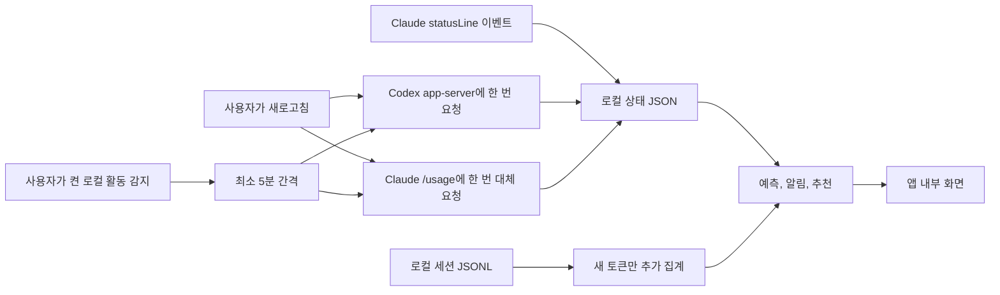

<p align="center">
  
</p>

<h1 align="center">Codex Claude Usage</h1>

<p align="center">
  <strong>리셋보다 먼저 AI 코딩 한도가 바닥날까?</strong><br>
  Codex CLI와 Claude Code의 소진 시각·비용·다음 행동을 로컬에서 계산하는 Windows 앱입니다.
</p>

<p align="center">
  <a href="https://github.com/Kyuhan1230/ai-usage-monitor/actions/workflows/ci.yml"></a>
  <a href="https://github.com/Kyuhan1230/ai-usage-monitor/releases/latest"></a>
  <a href="../LICENSE"></a>
  
</p>

<p align="center">
  <a href="https://github.com/Kyuhan1230/ai-usage-monitor/releases/latest"><strong>Windows용 다운로드</strong></a>
  · <a href="#설치와-첫-실행">설치와 첫 실행</a>
  · <a href="#화면-미리-보기">화면 미리 보기</a>
  · <a href="#개발">개발</a>
</p>

---

단순히 “몇 % 남았나”만 보여주지 않습니다. 한도 기록과 로컬 토큰 합계를 이용해 **언제 고갈되는지, 평소보다 얼마나 빨리 쓰는지, 지금 무엇을 바꿔야 하는지** 알려줍니다.

앱은 Windows PC 안에서 실행됩니다. 별도 Python, 로컬 웹 서버, 상시 CLI 수집 프로그램을 설치하지 않습니다.

> [!IMPORTANT]
> 이 프로젝트는 OpenAI 또는 Anthropic의 공식 제품이 아닙니다. OpenAI, Codex, Anthropic, Claude의 이름과 표장은 각 권리자의 자산입니다.

## 설치와 첫 실행

1. [최신 릴리스](https://github.com/Kyuhan1230/ai-usage-monitor/releases/latest)에서 `Codex-Claude-Usage-Setup-<version>.exe`를 내려받아 실행합니다.
2. 앱을 처음 실행하면 설정 화면이 자동으로 열립니다. Codex CLI와 Claude Code 중 사용하는 도구 하나만 연결해도 시작할 수 있습니다.
3. 필요한 도구에 표시된 **설치** 또는 **로그인** 버튼을 누릅니다. 터미널에서 직접 로그인하려면 다음 명령을 사용합니다.

   ```powershell
   codex login
   claude auth login
   ```

4. 로그인을 마친 뒤 **상태 다시 확인 → 설정 완료**를 누릅니다. 사용하지 않는 도구와 Claude `statusLine` 이벤트 연결은 건너뛰어도 됩니다.
5. **사용량 확인**을 누르면 최신 상태를 한 번 읽습니다. **활동 중 자동 확인**을 켜면 로컬 세션 파일이 바뀔 때만, 최소 5분 간격으로 상태를 확인합니다.

`X`를 누르면 화면만 닫히고 앱은 트레이에 남습니다. 앱을 완전히 종료하려면 트레이 메뉴에서 **Quit**을 선택합니다.

### 기존 버전에서 업데이트

- `1.1.1` 이하에서는 최신 설치 파일을 직접 내려받아 한 번 설치해야 합니다. 이 버전들에는 앱 안에서 업데이트하는 기능이 없습니다.
- `1.2.0` 이상에서는 설정 화면이나 트레이 메뉴의 **업데이트 확인**으로 새 버전을 확인할 수 있습니다. 내려받기와 설치는 사용자가 **업데이트**를 누른 뒤에만 시작합니다.
- 앱은 시작 15초 뒤 자동 확인 시각을 계산합니다. 같은 앱 버전에서 마지막 확인에 성공한 지 24시간이 지나지 않았다면 남은 시간까지 기다리고, 확인 시각이 되면 새 버전을 확인합니다. 최신 버전이면 조용히 넘어갑니다. 새 버전을 자동으로 처음 발견하면 Windows 알림을 버전당 한 번 요청하고, 트레이의 **vX.Y.Z 업데이트 가능** 항목을 유지합니다. Windows 알림이 꺼져 있어도 트레이 항목은 남습니다. 트레이 항목을 누르면 새 버전을 다시 확인한 뒤 업데이트 창을 엽니다.
- 사용량 기록과 설정은 설치 폴더가 아닌 `~/.codex-usage-wrapper`에 저장됩니다. 현재 업데이트 과정은 이 폴더를 지우지 않으므로 같은 Windows 사용자 계정에서 업데이트하면 기존 데이터가 유지됩니다.

### 설치 전에 알아둘 점

- 설치 파일에는 Codex CLI와 Claude Code가 들어 있지 않습니다. 두 도구 중 설치되지 않은 것이 있으면 설치 프로그램이 공식 설치 방법을 실행할지 각각 묻습니다. 동의한 도구만 내려받으며, 거절하거나 설치에 실패해도 이 앱의 설치는 계속됩니다.
- 별도 Node.js나 Python은 필요하지 않습니다.
- 앱과 설치 프로그램은 WebView2를 자동으로 내려받지 않습니다. WebView2가 제거된 Windows에서는 [Microsoft Edge WebView2 Runtime](https://developer.microsoft.com/microsoft-edge/webview2/)을 먼저 설치해야 합니다.
- 앱은 새 버전을 확인할 때 GitHub Release의 `latest.json`만 조회합니다. 사용자가 CLI 설치에 동의하면 해당 도구의 공식 설치 주소에도 연결합니다.

> [!WARNING]
> 업데이트 파일 검증 서명과 Windows 게시자 서명은 서로 다릅니다. 앱 안에서 받는 업데이트는 Tauri 업데이트 서명으로 파일이 공식 릴리스와 일치하는지 검증합니다. 현재 공개 설치 파일에는 Windows Authenticode 게시자 서명이 없습니다. 2026-07-23 SignPath Foundation 신청이 초기 공개 신뢰 신호 부족으로 승인되지 않아 SmartScreen에 `알 수 없는 게시자`가 표시될 수 있습니다.

## 화면 미리 보기

### 사용량 분석

<p align="center">
  
</p>

### 로컬 토큰 상세

<p align="center">
  
</p>

<table>
  <tr>
    <th width="40%">간단 보기</th>
    <th width="60%">초기 설정과 상태 확인</th>
  </tr>
  <tr>
    <td align="center"></td>
    <td align="center"></td>
  </tr>
  <tr>
    <td>남은 한도, 리셋 시각과 연결 상태를 작은 창에서 확인합니다.</td>
    <td>CLI 로그인, Claude 이벤트 연결, 로컬 상세 화면과 자동 실행 상태를 점검합니다.</td>
  </tr>
</table>

> [!NOTE]
> 스크린샷은 실제 앱 화면에 대표 샘플 데이터를 넣어 만든 것입니다. 개인 세션이나 로컬 사용량은 읽지 않았습니다.

## 무엇이 다른가

많은 오픈소스 사용량 도구가 누적 토큰이나 현재 잔여율을 보여주는 데서 끝납니다. 이 앱의 초점은 **의사결정**입니다.

| 질문 | 답변 |
| --- | --- |
| 리셋 전에 바닥나는가? | 관측 소진 속도와 예상 고갈 시각, 예측 신뢰도 |
| 갑자기 왜 빨리 줄었는가? | 평소 중앙값 기반 한도·토큰 이상 급증 감지 |
| 어제보다 많이 썼는가? | 전일 및 이전 7일 대비 |
| 모델을 바꾸면 얼마나 아끼는가? | 동일 토큰 가정의 저비용 모델 절약 가능성 |
| 그래서 지금 뭘 해야 하는가? | 필요한 감속 비율, 반복 작업 점검, 모델 변경 추천 |
| 내 데이터는 어디로 가는가? | 로컬 파일과 앱 내부 화면만 사용, 텔레메트리·수집 서버 없음 |

대표 오픈소스와는 경쟁 축이 다릅니다.

| 프로젝트 유형 | 가장 잘하는 것 | Codex Claude Usage의 선택 |
| --- | --- | --- |
| [ccusage](https://github.com/ryoppippi/ccusage) | 많은 AI CLI의 토큰·비용을 CLI/JSON으로 집계 | 지원 대상을 Codex·Claude로 좁히고 한도 고갈 예측과 행동 추천을 Windows UI로 제공 |
| [Claude Usage Dashboard](https://github.com/phuryn/claude-usage) | Claude 세션·프로젝트 히스토리와 브라우저 차트 | Python·로컬 웹 서버 없이 앱 내부에서 두 공급자를 함께 표시 |
| [Usage Monitor for Claude](https://github.com/jens-duttke/usage-monitor-for-claude) 등 네이티브 트레이 | 매우 가벼운 실시간 Claude 한도 표시 | 인증 파일을 직접 읽지 않고 기존 CLI에 필요할 때 한 번씩 상태를 요청하거나 Claude `statusLine` 이벤트를 사용하며, 예측·비교·비용까지 연결 |

따라서 **많은 도구 지원이나 터미널 자동화가 우선이면 ccusage가 더 적합**합니다. 이 앱은 “오늘 이 속도로 쓰면 리셋 전에 막히는가, 그렇다면 지금 무엇을 바꿀까”가 필요한 Windows 사용자에게 맞습니다.

### 측정된 경량성

2026-07-18 Windows 릴리스 빌드의 참고 측정값입니다. 시스템과 WebView2 버전에 따라 달라질 수 있으며, 창을 연 상태의 비용도 함께 공개합니다.

| 상태 | 결과 |
| --- | --- |
| 애플리케이션 EXE | 4.41MB |
| NSIS 설치 파일 | 1.47MB |
| 로그인 시작/콜드 트레이 대기 | 11.43MB, 앱 프로세스 1개, WebView 0개 |
| UI를 닫은 뒤 트레이 대기 | 25.28MB, 앱 프로세스 1개, CPU 측정값 0%, WebView 0개 |
| 간단 보기 화면 표시 중 | 427.05MB, 앱+시스템 WebView2 7개 프로세스 |
| 모든 대기 상태 | Codex/Claude CLI 0개, 네트워크 대기 포트 0개 |

UI가 열린 동안에는 WebView2 메모리 비용이 큽니다. 그래서 로그인 시작은 창을 만들지 않고, 트레이 클릭 때만 WebView를 로드하며, `X`를 누르면 창과 WebView 프로세스를 파기합니다.

## 주요 기능

| 영역 | 제공 기능 |
| --- | --- |
| 한도 모니터링 | Codex 5시간/주간, Claude 현재 세션/주간 잔여율과 시간당 소진 속도 |
| 고갈 예측 | 30분·2시간 단위로 다듬은 최근 평균 속도, 빠른/느린 고갈 예상, 한도 초기화 전 소진 여부와 근거 |
| 로컬 알림 | 잔여 25% 주의·10% 위험, 이상 급증, 한도 초기화 전 고갈 예측 |
| 비교·비용 | 오늘/전일, 최근 7일/이전 7일 비교와 API 정가 기준 비용 등가 추정 |
| 실행 가능한 추천 | 한도 초기화까지 필요한 감속 비율, 반복 작업 점검, 저비용 모델 전환 가능성을 규칙 기반으로 제안 |
| 상세 집계 | 날짜별·모델별 입력, 캐시 입력, 캐시 쓰기, 출력, 추론 토큰 |
| 가벼운 수집 | 수동 새로고침 또는 사용자가 켠 활동 감지 시에만 CLI를 짧게 한 번 실행; 앱 대기 중 별도 프로세스 없음 |
| 로컬 전용 화면 | 별도 Python·HTTP 서버·열린 포트 없이 앱 내부에서 모든 결과 표시 |
| 데스크톱 앱 | Windows 트레이, 항상 위 표시, 투명도, 로그인 시 자동 실행 |
| 사용자 승인 업데이트 | 앱을 켜 둔 동안에도 새 버전을 주기적으로 확인하고 Windows 알림·트레이에 표시하며, 사용자가 업데이트 버튼을 누른 경우에만 검증된 설치 파일을 내려받아 설치·재시작 |

## 작동 방식



- Codex는 사용자가 새로고침할 때 공식 app-server의 `account/rateLimits/read`만 한 번 호출하고 즉시 종료합니다. 앱에서 쓰지 않는 계정 사용량 응답은 요청하거나 저장하지 않습니다.
- Claude는 `statusLine` 이벤트(상태 표시줄 갱신 알림)를 기본 경로로 사용합니다. 수동 새로고침의 `/usage` 요청은 초기값이 필요할 때만 한 번 사용합니다.
- 자동 확인을 켜면 트레이에서 실행 중인 앱이 1분마다 로컬 세션 파일의 변경 시각만 확인합니다. 활동이 감지돼도 CLI는 최소 5분 간격으로 한 번 실행합니다. 자동 확인을 끄면 파일 변경 시각도 확인하지 않습니다.
- 상시 CLI 조회, 프로세스 번호 감시, 수집 프로세스 자동 재시작, 로컬 웹 서버가 없습니다.
- 앱은 `~/.codex/sessions`와 `~/.claude/projects`에서 새로 생긴 토큰 숫자만 추가로 집계합니다. 프롬프트와 응답 본문은 분석 결과에 복사하지 않습니다.

### 로컬 데이터

| 데이터 | 기본 위치 |
| --- | --- |
| Codex 최신 상태 | `~/.codex-usage-wrapper/status.json` |
| Claude 최신 상태 | `~/.codex-usage-wrapper/claude-status.json` |
| 변경 시점 히스토리 | `~/.codex-usage-wrapper/history/YYYY-MM-DD.jsonl` |
| 분석 결과 | `~/.codex-usage-wrapper/analytics.json` |
| 토큰 집계 캐시 | `~/.codex-usage-wrapper/token-usage-cache.json` |
| 활동 기반 자동 확인 설정 | `~/.codex-usage-wrapper/monitoring.json` |

## 개인정보 보호와 보안

- 자체 서버, 광고, 원격 텔레메트리가 없습니다.
- 인증 토큰, 브라우저 쿠키, 프롬프트와 응답 본문을 수집하지 않습니다.
- 사용량·분석 결과는 `~/.codex-usage-wrapper`에만 저장됩니다.
- 앱 자체의 텔레메트리·원격 분석 요청은 없습니다.
- 같은 앱 버전에서는 확인 성공 24시간 뒤 다시 확인합니다. 자동 확인이 실패하면 15분 뒤, 다시 실패하면 1시간 뒤, 이후에는 6시간 간격으로 재시도합니다. 앱 버전이 바뀌면 이전 성공 시각과 관계없이 확인하며, 설정 화면이나 트레이 메뉴에서는 언제든 직접 확인할 수 있습니다. 자동 확인은 업데이트 창을 강제로 띄우지 않습니다.
- 수동 새로고침과 사용자가 켠 활동 기반 자동 확인은 CLI를 필요할 때 한 번씩 실행합니다. 이때 통신과 인증은 각 CLI가 관리합니다.
- NSIS 설치 프로그램도 WebView2를 자동 다운로드하지 않고 Windows에 이미 설치된 런타임만 사용합니다.
- 로컬 HTTP 서버나 네트워크 대기 포트를 열지 않습니다.

자세한 내용은 [개인정보 처리 방침](PRIVACY.md), [보안 정책](../SECURITY.md), [코드 서명 정책](CODE_SIGNING_POLICY.md)을 확인하세요.

## 개발

### 개발 환경

- Windows 10 이상
- Node.js 22.12 이상
- Rust stable MSVC toolchain
- Microsoft C++ Build Tools와 WebView2
- Codex CLI 및 Claude Code(실데이터 확인 시)

### 실행, 테스트, 빌드

```powershell
git clone https://github.com/Kyuhan1230/ai-usage-monitor.git
cd ai-usage-monitor
npm ci
npm test
npm run app
npm run dist
```

Tauri NSIS 설치 파일은 `src-tauri/target/release/bundle/nsis/`에 만들어집니다. 일반 CI에서는 업데이트 파일 생성을 끈 별도 설정으로 게시자 서명 없는 설치 파일을 검증합니다. 릴리스 작업에서는 GitHub secret에 저장한 Tauri 개인키로 업데이트 검증 파일인 `.exe.sig`와 `latest.json`을 만듭니다. 두 자동화 작업 모두 설치 파일이 20MB를 넘으면 실패 처리합니다.

### 프로젝트 구성

```text
.github/workflows/        CI와 릴리스 자동화 설정
assets/                   Windows 앱 아이콘
docs/images/              재현 가능한 UI 스크린샷
scripts/                  릴리스 태그·업데이트 목록 생성 및 검증 도구
src/ui/                   프레임워크 없는 내장 HTML/CSS/JS 화면
src-tauri/                Rust 수집·분석·트레이·패키징 백엔드
tests/                    UI 계약과 로컬 전용 경계 테스트
```

## 문제 해결

<details>
<summary><strong>Codex 또는 Claude 값이 오래됨으로 표시됩니다.</strong></summary>

1. 설정 화면에서 해당 CLI와 로그인 상태를 확인합니다.
2. **지금 다시 계산**을 눌러 한 번 수집한 결과를 확인합니다.
3. Claude는 `statusLine` 이벤트 연결 상태를 확인합니다.
4. 계속되면 `~/.codex-usage-wrapper/status.json`과 `claude-status.json`의 수정 시각을 확인합니다.

</details>

<details>
<summary><strong>Codex 데스크톱 앱은 설치했는데 CLI 설치 안내가 표시됩니다.</strong></summary>

Microsoft Store의 Codex 데스크톱 앱에 포함된 실행 파일은 패키지 보호 대상이라 다른 앱에서 CLI처럼 실행할 수 없습니다. 설정 화면의 **Codex 설치**에서 독립 실행 Codex CLI를 설치한 뒤 **상태 다시 확인**을 누르세요. 앱은 최신 사용자 PATH를 다시 읽으므로 실행 중 설치된 CLI도 감지하며, 보호된 데스크톱 앱을 실행 가능한 CLI로 오인하지 않습니다.

</details>

<details>
<summary><strong>토큰 상세가 비어 있습니다.</strong></summary>

Codex 또는 Claude Code로 작업한 뒤 다시 계산합니다. 앱은 `~/.codex/sessions`와 `~/.claude/projects`의 로컬 JSONL이 존재할 때만 모델·날짜별 합계를 만들 수 있습니다.

</details>

## 현재 제약

- Codex 수집은 설치된 CLI의 app-server 계정 메서드 지원 여부에 의존합니다.
- Claude 단발 대체 경로는 `/usage` 출력 형식에 의존합니다.
- 비용은 실제 구독 청구액이 아니라 [OpenAI](https://openai.com/api/pricing/)와 [Anthropic](https://platform.claude.com/docs/en/about-claude/pricing)의 2026-07-18 API 표준 정가로 환산한 참고치입니다. GPT-5.6 캐시 쓰기는 공식 1.25배 규칙을 적용하며, 가격을 알 수 없는 모델은 제외합니다.
- 요금제 이름과 실제 구독 크레딧은 자동 판별하지 않습니다.
- 현재 공개 설치 파일에는 Windows Authenticode 게시자 서명이 없습니다. 2026-07-23 SignPath Foundation 첫 신청은 초기 공개 신뢰 신호 부족으로 승인되지 않았으며, 앱 안에서 받는 업데이트 파일의 Tauri 검증 서명과는 별개입니다.

## 기여

[기여 가이드](../CONTRIBUTING.md) · [버그 신고](https://github.com/Kyuhan1230/ai-usage-monitor/issues/new?template=bug_report.yml) · [기능 제안](https://github.com/Kyuhan1230/ai-usage-monitor/issues/new?template=feature_request.yml)

제품 방향과 공개 체크리스트는 [출시 계획](LAUNCH_PLAN.md)에 기록했습니다.

## 라이선스

[MIT License](../LICENSE) · Copyright © 2026 kyuhan1230

현재 공개 설치 파일에는 Windows Authenticode 게시자 서명이 없습니다. SignPath Foundation에는 공개 신뢰 신호를 쌓은 뒤 재신청할 계획입니다.
