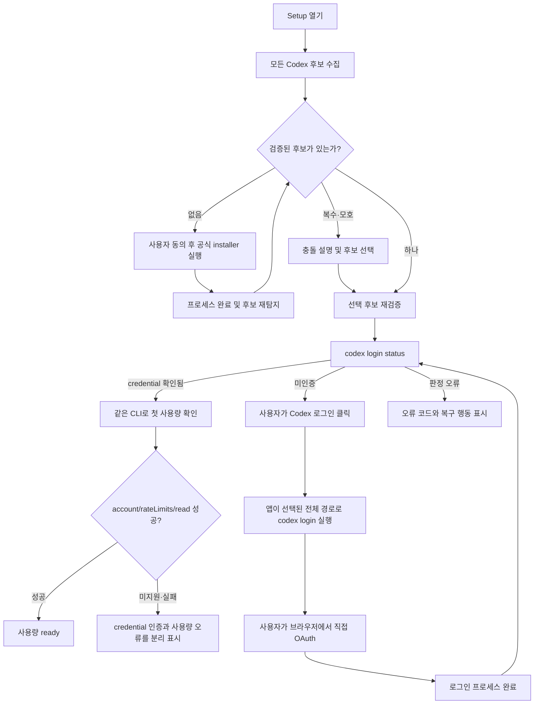

# Codex CLI 설치·탐지·로그인 강화 명세

> 상태: In progress — implementation commit T2 통과, 최종 standard CI 재실행과 사람 T3 대기
> 적용 범위: Windows용 Codex Claude Usage의 Codex CLI 온보딩
> 기준 앱 버전: 1.2.8
> 최초 작성: 2026-07-30
> 관련 이슈: [#33 Codex 로그인 이슈](https://github.com/Kyuhan1230/ai-usage-monitor/issues/33)
> 선행 수정: [PR #34](https://github.com/Kyuhan1230/ai-usage-monitor/pull/34)

## 1. 문서의 역할과 권위

이 문서는 Codex CLI의 설치, 발견, 실체·호환성 확인, 후보 선택, 로그인 시작, 로그인 상태 재확인, 첫 사용량 확인까지를 하나의 흐름으로 정의하는 현재형 정본(canonical specification)이다.

기존에도 개별 기능과 개인정보 원칙은 있었다. 그러나 다음 전체 경로를 하나의 상태 머신과 시험 행렬로 묶은 문서는 없었다.

```text
CLI 없음
→ 공식 설치에 대한 사용자 동의
→ 설치 프로세스 실행 및 결과 확인
→ 모든 CLI 후보 재발견
→ 실제 실행 가능성과 호환성 확인
→ 복수 설치 충돌 해결
→ 사용자가 로그인 시작
→ 사용자가 브라우저에서 직접 인증
→ 앱이 로그인 상태 재확인
→ 실제 app-server 사용량 확인
```

`docs/refactor/` 아래 문서는 각 버전에서 내린 역사적 결정 기록이다. 역사 문서와 이 명세가 충돌하면 이 명세가 우선한다. 제품 전체의 “Codex 또는 Claude 중 하나만 연결해도 시작할 수 있다”는 현재 정책은 유지하며, 이 문서는 그중 Codex 경로만 강화한다.

구현 체크리스트와 완료 조건은 [task.md](task.md)에 둔다.

## 2. 기존에 있었던 것과 없었던 것

### 2.1 이미 있던 계약

| 영역 | 기존 계약 | 근거 |
| --- | --- | --- |
| 데스크톱 번들 제외 | Microsoft Store 데스크톱 앱 내부의 보호된 `codex.exe`를 독립 CLI로 사용하지 않는다. | [1.0.2 CLI 인증 경로 수정](../refactor/1.0.2-cli-auth-detection.md) |
| 실행 중 PATH 갱신 | 앱 시작 후 설치된 CLI도 찾도록 프로세스 PATH뿐 아니라 HKCU/HKLM PATH를 다시 읽는다. | [1.0.3 live PATH refresh](../refactor/1.0.3-live-path-refresh.md) |
| 선택 설치 | Codex CLI 설치는 명시적 동의를 받아 공식 설치 스크립트로 수행하고, 기본 선택은 “아니요”다. | [1.0.4 Codex CLI 선택 설치](../refactor/1.0.4-opt-in-codex-cli-install.md) |
| 인증 확인 | Setup은 `codex login status`를 최대 8초 실행하고 계정 정보가 포함될 수 있는 출력을 저장하거나 표시하지 않는다. | [1.0.5 첫 실행 온보딩](../refactor/1.0.5-first-run-onboarding.md), [개인정보 처리방침](../PRIVACY.md) |
| 사용자 책임 | 앱은 로그인 명령을 시작하지만 계정 입력과 OAuth 승인은 사용자가 Codex와 브라우저에서 직접 수행한다. | [README](../../README.md), [개인정보 처리방침](../PRIVACY.md) |
| 공급자 선택 | Codex 또는 Claude 중 사용자가 선택한 한 공급자만 인증해도 온보딩을 완료할 수 있다. | [1.1.1 단일 공급자 온보딩](../refactor/1.1.1-single-provider-onboarding.md), [README](../../README.md) |

### 2.2 없었던 종단 간 계약

다음 항목은 기존 문서와 코드에 완전한 계약이 없었다.

- 발견한 파일이 실제로 실행 가능한 Codex CLI인지 확인하는 절차
- `codex --version`과 필요한 하위 명령의 호환성 판정
- 공식 standalone, 예전 npm 설치, PATH 설치가 동시에 있을 때의 선택 규칙
- `CODEX_INSTALL_DIR` 같은 사용자 지정 설치 위치와 수동 선택
- 설치·로그인 프로세스의 `running / succeeded / failed / cancelled` 수명주기
- 설치 창 또는 로그인 창을 “열었다”는 사실과 작업 성공을 구분하는 규칙
- 로그인 완료 뒤 앱이 자동으로 상태를 다시 확인하는 규칙
- npm 기반 Codex가 선택됐지만 Node 런타임을 찾지 못하는 경우의 진단
- 개발용 Node/npm/Rust와 고객 PC의 런타임 요구사항을 분리한 설명
- 가짜 CLI 시험, 실제 공식 설치 시험, 실제 브라우저 OAuth 시험의 등급 구분
- 개인정보를 노출하지 않으면서 재현 가능한 오류 코드와 시험 증거를 남기는 방식

## 3. 구현과 증거의 정확한 경계

### 3.1 이 작업 전 기준선

이 명세를 작성하기 전 구현은 다음 순서에서 첫 번째로 존재하는 파일을 선택했다.

1. 현재 PATH의 `codex.exe`
2. 현재 또는 새로 읽은 PATH의 `codex`, `codex.exe`, `codex.cmd`, `codex.bat`
3. `%LOCALAPPDATA%\Programs\OpenAI\Codex\bin\codex.exe`
4. `%APPDATA%\npm\codex.cmd`
5. `~\.local\bin\codex.exe`

WindowsApps 데스크톱 번들과 App Execution Alias는 제외했지만, 존재 여부 외에 version·실행 가능성·필수 명령·복수 설치 충돌은 확인하지 않았다. 설치와 로그인은 `-NoExit` 창을 연 직후 `opened`를 반환했고 child process의 완료·실패·취소를 추적하지 않았다. 비정상 `codex login status`는 원인과 무관하게 모두 미인증으로 축약됐다.

PR #34의 [Windows Actions 실행](https://github.com/Kyuhan1230/ai-usage-monitor/actions/runs/30543705785)은 이 기준선에서 WindowsApps 형태의 빈 파일 제외, 별도 가짜 `codex.cmd` 선택, 가짜 login status의 종료 코드 `0 / 1` 매핑을 실제 Windows 자식 프로세스로 확인했다. 당시 Rust 시험 47개, UI·릴리스 시험, NSIS 빌드와 크기 제한이 통과했고 installer SHA-256은 `8429B7AF76C6572374F24B4E96E82957774D34FAFBB7FEDA4B8C214119EE39AD`였다. 이 값은 새 구현의 release candidate hash가 아니라 변경 전 T1 기준선 증거다.

### 3.2 이 명세에 따라 구현한 범위

현재 작업 branch는 이 문서의 상태 모델을 다음 코드 계약으로 구현한다.

- 모든 발견 위치를 inventory로 만든 뒤 canonicalize·deduplicate하고, 데스크톱 번들과 실행 별칭을 경로 규칙으로 제외한다.
- 각 후보에 bounded `--version`, `login --help`, `login status`, `app-server --help` probe를 실행하고 launcher·version·capability·런타임 오류를 분리한다.
- 공식 standalone, tracked installer 결과, 명시적 사용자 선택, 이전 선택의 salted fingerprint, PATH/npm 후보 순으로 결정하며 동률 충돌은 renderer에 전체 경로를 주지 않는 선택 UI에서 멈춘다.
- 설치는 고정된 공식 URL과 명시적 사용자 승인을 사용하고, 보이는 PowerShell child를 `-NoExit` 없이 추적한다. 설치 전후 후보 hash를 비교해 정확히 한 개의 새 호환 후보가 생긴 경우에만 해당 작업의 provenance를 부여한다.
- 로그인은 방금 재검증한 선택 CLI를 전체 경로로 실행하고 child 종료 뒤 같은 CLI의 `login status`를 다시 확인한다. 창 열기나 종료 코드만으로 인증 성공을 선언하지 않는다.
- 설치와 로그인 작업은 동시에 시작할 수 없으며 상태·취소·10분 장기 실행·앱 재시작 뒤 detached 복구가 각각 정의돼 있다.
- raw CLI 출력, credential, 전체 사용자 경로는 renderer와 evidence artifact에 보내지 않는다. 지속 선택에는 앱별 salt로 계산한 path fingerprint만 저장하고, 수동 off-PATH 선택은 현재 세션에만 둔다.
- 사용량 수집도 Setup이 선택·검증한 같은 CLI handle을 사용하며 app-server 입출력은 크기와 시간 제한을 둔다.

정확한 발견 순서, probe, 선택, operation, IPC와 UI 상태는 아래 8장부터 15장까지가 권위 있는 계약이다. 구현 파일 목록과 task별 검증은 [task.md](task.md)에 둔다.

### 3.3 아직 분리해야 하는 시험 증거

로컬 또는 가짜 CLI 시험이 통과해도 실제 사용자 로그인이 검증됐다고 표현하지 않는다.

| 등급 | 검증 대상 | 자동화 여부 | 현재 릴리스 조건 |
| --- | --- | --- | --- |
| T0 | 순수 상태·선택·오류 매핑 | 자동 | 모든 PR에서 필수 |
| T1 | 실제 Windows process boundary와 가짜 CLI | 자동 | 모든 PR에서 필수 |
| T2 | 공식 `install.ps1`, 기본/custom 위치, 실제 바이너리와 격리된 미인증 상태 | GitHub-hosted Windows 자동 | release candidate commit에서 필수 |
| T3 | 보이는 로그인 terminal, 실제 브라우저 OAuth/MFA, 첫 사용량, restart/reboot/conflict/uninstall | 폐기 가능한 Windows VM에서 사람 수행 | 공개 release 전에 독립 검토와 함께 필수 |

T2는 `.github/workflows/codex-cli-installer-smoke.yml`이 실행하고 개인정보 없는 구조화 evidence를 남긴다. T3는 [REMOTE_WINDOWS_TEST.md](REMOTE_WINDOWS_TEST.md)와 [설치 smoke 보고서 template](../community/INSTALL_SMOKE_REPORT_TEMPLATE.md)을 사용한다. 계정 secret이나 OAuth를 CI에 넣지 않는다.

T2 implementation snapshot은 [2026-07-31 원격 T2 증거](evidence/REMOTE_T2_2026-07-31.md)에 고정돼 있다. 그러나 그 뒤 documentation commit을 포함해 release commit이 바뀌면 같은 commit에서 T2를 다시 실행해야 한다. T3 보고서가 독립 검토를 통과하기 전에는 로그인 전체 흐름이나 공개 배포 준비 완료를 주장하지 않는다. 다음 항목은 T0/T1 또는 문서 검토만으로 확인했다고 표현해서는 안 된다.

- Microsoft가 실제 생성한 App Execution Alias의 모든 Windows build별 동작
- OpenAI 공식 설치 스크립트의 미래 변경과 모든 네트워크 장애
- 실제 브라우저 OAuth, MFA, workspace 선택
- 실제 계정의 `account/rateLimits/read`
- 실제 NSIS 설치 뒤 재부팅·충돌·제거까지 포함한 사용자 흐름

### 3.4 2026-07-31 원격 증거와 현재 No-Go

Implementation commit `62c208c6821aa3db5c38da03c4ee2b8229d56492`에서 [T2 run 30567446372](https://github.com/Kyuhan1230/ai-usage-monitor/actions/runs/30567446372)의 기본 위치와 custom 위치 job이 모두 통과했다. 두 job은 같은 공식 installer script SHA-256 `391F247DE2C70C7E99041979EC02DAE7E76BE27AC9CFC1DFE7C1EB21D48D8B97`, Codex CLI `0.146.0`, 격리 `CODEX_HOME`의 `authenticated=false`와 repository live harness 성공을 기록했다.

같은 implementation commit의 [standard CI run 30567446378](https://github.com/Kyuhan1230/ai-usage-monitor/actions/runs/30567446378)은 test와 NSIS build 뒤 silent install의 installed-app byte comparison assertion에서 실패했다. 원인 수정 뒤 전체 standard CI와 변경된 release commit의 T2를 다시 통과하기 전까지 자동 gate는 pending이다.

사람 T3는 아직 수행하지 않았다. [원격 운영 결정](remote-test-decision.md)의 비용·image·담당자 `TBD`, 독립 tester/reviewer, protected `production-release` environment와 release immutability가 닫히기 전까지 공개 Release는 **No-Go**다.

## 4. 공식 외부 계약

2026-07-30에 다음 OpenAI 공식 문서를 기준으로 확인했다.

- [Codex installer variables](https://learn.chatgpt.com/docs/config-file/environment-variables#installer-variables)
  - Windows standalone 설치 스크립트는 `https://chatgpt.com/codex/install.ps1`이다.
  - 기본 표시 명령 위치는 `%LOCALAPPDATA%\Programs\OpenAI\Codex\bin`이다.
  - `CODEX_INSTALL_DIR`로 표시 명령 위치를 바꿀 수 있다.
  - standalone package cache는 `CODEX_HOME/packages/standalone` 아래에 존재할 수 있다.
  - `CODEX_NON_INTERACTIVE=1`은 자동화된 설치에서 prompt를 건너뛴다.
- [Codex developer commands: `codex login`](https://learn.chatgpt.com/docs/developer-commands#codex-login)
  - 플래그 없는 `codex login`은 ChatGPT OAuth를 위해 브라우저를 연다.
  - `codex login status`는 credential이 있으면 종료 코드 `0`을 반환한다.
  - 브라우저를 열 수 없을 때 device-code flow를 사용할 수 있다.

[공식 인증 문서](https://developers.openai.com/codex/auth)는 Codex CLI가 ChatGPT browser sign-in뿐 아니라 API key sign-in도 지원한다고 설명한다. 따라서 `login status` exit `0`은 “Codex가 어떤 credential을 가지고 있다”는 증거이지 ChatGPT subscription의 `account/rateLimits/read`가 성공한다는 증거가 아니다. 이 앱은 API key나 access token 입력을 자동화하지 않는다. 이 명세는 credential 인증과 현재 사용량 연결 준비를 별도 상태로 판정하도록 요구하며, 전용 Setup usage state 구현은 [task.md의 CSH-058](task.md#csh-058-credential-인증과-사용량-준비-분리)이 완료되기 전까지 pending이다. 그 전에도 현재 collector 요청이 실패하면 연결 성공으로 표시하면 안 된다.

외부 설치 스크립트와 CLI 동작은 앱 저장소와 독립적으로 바뀔 수 있다. 따라서 공식 URL이나 기본 경로만으로 성공을 추정하지 않고, 설치 뒤 실제 후보를 다시 발견하고 검증한다.

`CODEX_HOME/packages/standalone`은 package cache이며 공개된 표시 명령 위치가 아니다. cache 내부 실행 파일을 직접 찾아 실행하는 기능은 구현하지 않는다.

## 5. 용어

| 용어 | 정의 |
| --- | --- |
| 고객 런타임 | Release installer로 앱을 설치하고 사용하는 PC 환경 |
| 개발 툴체인 | 저장소를 빌드·시험할 때만 필요한 Node.js, npm, Rust, C++ Build Tools |
| standalone CLI | OpenAI 공식 `install.ps1`이 설치한 native Codex 명령 |
| package-manager CLI | npm 등 패키지 관리자가 설치한 `codex.cmd` 또는 동등한 launcher |
| 데스크톱 번들 | Microsoft Store/ChatGPT 데스크톱 패키지 내부의 보호된 Codex 실행 파일 |
| 실행 별칭 | `%LOCALAPPDATA%\Microsoft\WindowsApps` 아래의 Windows App Execution Alias |
| 후보(candidate) | 파일 시스템이나 PATH에서 발견했지만 아직 검증이 끝나지 않은 경로 |
| 검증된 후보 | 제외 규칙을 통과하고 실행·버전·필수 명령 capability 확인을 마친 후보 |
| 발견 source | 후보를 찾은 위치 종류다. `default_standalone_path`는 기본 경로에서 찾았다는 뜻이지 OpenAI 진본 보증이 아니다. |
| provenance confidence | publisher signature, 추적한 공식 설치 session 등으로 후보 출처를 얼마나 확인했는지 나타내는 별도 값 |
| 선택된 CLI | 로그인과 수집에 실제로 사용할 하나의 검증된 후보 |
| 설치 성공 | 설치 프로세스가 끝난 뒤 검증된 CLI가 다시 발견된 상태 |
| 로그인 성공 | 선택된 CLI의 `codex login status`가 인증됨을 증명한 상태 |

“npm 버전”은 두 의미를 섞지 않는다.

1. 개발 툴체인의 npm client 버전
2. 고객 PC에 과거 npm으로 설치된 Codex launcher

두 항목의 지원과 오류 처리는 서로 독립적이다. 이미 설치된 npm Codex launcher를 실행할 때 npm client 자체를 매번 사용하지는 않는다. 이때 핵심은 launcher가 가리키는 Codex package, Node runtime의 존재·version·architecture와 CLI capability다.

## 6. 목표와 비목표

### 6.1 목표

1. 지원하는 모든 설치 형태에서 앱 재시작 없이 유효한 Codex CLI를 찾는다.
2. 파일 존재가 아니라 실행 결과와 capability를 근거로 CLI 준비 상태를 판정한다.
3. 복수 설치가 있어도 결정적이고 설명 가능한 방식으로 하나를 선택한다.
4. 공식 설치, custom path, legacy npm 설치의 차이를 사용자에게 정확히 설명한다.
5. 앱이 설치·로그인 프로세스의 상태를 추적하고 완료 뒤 자동으로 재확인한다.
6. 사용자는 계정 인증만 직접 수행하고, 앱은 비밀번호·토큰·쿠키를 절대 받지 않는다.
7. 모의 시험, 실제 설치 시험, 실제 OAuth 시험을 구분해 릴리스 증거를 남긴다.
8. 고객 런타임과 개발 툴체인의 요구사항을 분리하고 빌드 재현성을 높인다.

### 6.2 비목표

- Codex CLI를 제품 installer에 번들하는 것
- 사용자 동의 없이 Codex CLI를 설치하거나 업데이트하는 것
- 앱이 ChatGPT 계정 정보, 비밀번호, MFA 코드, access token 또는 브라우저 쿠키를 받는 것
- CI secret으로 실제 사용자 OAuth를 자동화하는 것
- `--version` 문자열만으로 바이너리의 암호학적 출처를 보증하는 것
- WSL 내부에만 설치된 Linux Codex CLI를 Windows 앱에서 실행하는 것
- 이 작업에서 Claude Code 온보딩을 재설계하는 것

## 7. 런타임과 개발 툴체인 계약

### 7.1 고객 PC

- Release installer로 설치한 Codex Claude Usage 자체를 실행하는 데 Node.js, npm, Rust는 필요하지 않다.
- OpenAI 공식 standalone Codex를 설치하는 데 이 앱이 Node.js, npm, Rust를 설치하지 않는다.
- 과거 npm 기반 Codex를 선택한 경우에만 해당 launcher가 요구하는 Node.js가 고객 PATH에서 실행 가능해야 한다.
- npm launcher가 있지만 Node.js를 실행할 수 없으면 `ready`가 아니라 `runtime_dependency_missing`으로 판정한다.
- Node는 있지만 지원 version보다 낮거나 architecture가 호환되지 않으면 `runtime_dependency_incompatible`로 판정한다. 깨진 launcher나 잘못된 package는 근거 없이 Node 문제로 단정하지 않고 candidate probe 오류로 분류한다.
- Rust는 고객 PC에 자동 설치하지 않는다. Rust는 앱 개발·빌드에만 필요하다.

### 7.2 개발자와 CI

- Node.js는 `22.12.0`, npm은 [해당 Node 배포판에 포함된 `10.9.0`](https://nodejs.org/en/download/archive/v22.12.0)으로 고정한다.
- `package.json`의 `packageManager`, repository의 Node version file, CI setup 값을 일치시킨다.
- Rust는 “stable” floating channel을 계속 사용하지 않는다. 현재 green CI에서 확인한 정확한 compiler version을 `rust-toolchain.toml`에 고정한다.
- `Cargo.lock`과 `package-lock.json`을 계속 사용하며 CI는 `npm ci`, Cargo는 `--locked`로 실행한다.
- GitHub Actions도 가능한 경우 commit SHA로 고정하고, 업데이트는 별도 의존성 변경으로 검토한다.

| 환경 | Rust 동작 |
| --- | --- |
| Release 고객 PC | Rust가 필요 없고 앱이 Rust나 rustup을 설치하지 않는다. |
| rustup이 없는 개발자 PC | 자동 설치되지 않는다. preflight가 실패하고 명시적 설치 안내만 제공한다. |
| rustup이 있는 개발자 PC | repository에서 `cargo`/`rustc`를 처음 실행할 때 `rust-toolchain.toml`의 pinned toolchain과 component가 없으면 rustup이 자동 다운로드할 수 있다. 전역 default toolchain을 바꾸는 것과는 다르다. |
| GitHub Actions | workflow가 pinned Rust toolchain을 자동 준비한다. |

## 8. 목표 상태 모델

설치 파일 존재, 설치 작업, 로그인 프로세스, credential 인증 사실과 사용량 준비를 하나의 문자열로 섞지 않는다. 목표 모델은 다음 다섯 축을 독립적으로 유지한다. 이 중 전용 Setup usage readiness 축은 CSH-058의 미완료 후속 구현이며, 현재 구현 완료로 간주하지 않는다.

### 8.1 CLI 상태

| 상태 | 의미 | 허용 행동 |
| --- | --- | --- |
| `probing` | 후보를 수집·검증 중 | 중복 실행 방지, 진행 표시 |
| `missing` | CLI 후보가 없음 | 공식 설치, 경로 다시 확인 |
| `desktop_bundle_only` | 데스크톱 번들 또는 실행 별칭만 있음 | 독립 CLI 설치 |
| `invalid_candidate` | 파일은 있으나 실행 또는 버전 확인 실패 | 진단 보기, 다른 경로 선택, 재설치 |
| `runtime_dependency_missing` | package-manager launcher의 Node 등 런타임이 없음 | standalone 설치 권장 |
| `runtime_dependency_incompatible` | Node가 있지만 version 또는 architecture가 launcher와 호환되지 않음 | standalone 설치 또는 Node 정비 |
| `unsupported` | Codex이지만 필수 명령 capability가 없음 | CLI 업데이트 |
| `conflict` | 검증된 후보가 둘 이상이고 자동 선택만으로 안전하지 않음 | 후보 선택 또는 충돌 해소 |
| `ready` | 선택된 검증 후보가 있음 | 로그인 상태 확인, 로그인, 사용량 확인 |
| `probe_error` | 권한·정책·시간 초과 등으로 판정 불가 | 재시도와 안전한 오류 안내 |

### 8.2 설치 작업 상태

| 상태 | 의미 |
| --- | --- |
| `idle` | 설치 작업 없음 |
| `consent_required` | 공식 URL과 변경 내용을 보여 주고 사용자 선택 대기 |
| `starting` | PowerShell 시작 중 |
| `running` | 공식 설치 스크립트 실행 중 |
| `long_running` | 10분을 넘겼으나 프로세스는 계속 실행 중 |
| `succeeded` | 프로세스 뒤 재탐지에서 검증된 CLI 확인 |
| `failed` | 실행 실패 또는 종료 뒤 검증된 CLI 없음 |
| `cancelled` | 사용자가 앱에서 취소하거나 실행 전 동의를 거절 |
| `detached` | 앱이 종료되어 작업 추적은 끊겼으며 다음 실행에서 재탐지 필요 |

PowerShell 창을 열었다는 사실은 `starting` 또는 `running`일 뿐 `succeeded`가 아니다. 종료 코드 `0`도 단독 성공 기준이 아니다. 최종 성공은 검증된 CLI 재발견으로 결정한다.

### 8.3 로그인 작업 상태

로그인 프로세스 진행과 실제 credential 상태는 별개다.

| 상태 | 의미 |
| --- | --- |
| `idle` | 로그인 작업 없음 |
| `starting` | 선택된 CLI의 로그인 terminal 시작 중 |
| `running` | `codex login` 또는 device-code flow 실행 중 |
| `long_running` | 10분을 넘겼으나 사용자가 browser/device 인증을 계속할 수 있음 |
| `exited` | 로그인 프로세스가 끝나 auth 재확인을 시작하거나 기다리는 중 |
| `failed` | process spawn 또는 추적 자체가 실패 |
| `cancelled` | 사용자가 앱의 취소 행동으로 작업을 종료 |
| `detached` | 앱이 먼저 종료되어 추적이 끊겼으며 다음 실행에서 auth 재확인 필요 |

`exited`는 로그인 성공이 아니다. 최종 성공 여부는 별도 인증 상태로만 결정한다.

### 8.4 인증 상태

| 상태 | 의미 |
| --- | --- |
| `unavailable` | 선택된 CLI가 없어 인증 확인 불가 |
| `checking` | `codex login status` 실행 중 |
| `unauthenticated` | 지원되는 CLI에서 “credential 없음”이 확인됨 |
| `authenticated` | `codex login status` 종료 코드 `0` |
| `error` | 명령 미지원, 권한, timeout, 예기치 않은 종료 등으로 판정 불가 |

공식 문서는 `0`을 인증됨의 증거로 정의하지만 모든 nonzero의 의미를 보장하지 않는다. 따라서 다음 규칙을 적용한다.

- `0`은 `authenticated`다.
- 지원 버전별 characterization test에서 확인한 “credential 없음” 결과만 `unauthenticated`다.
- 미지원 명령, spawn 실패, 접근 거부, timeout, 알 수 없는 nonzero는 `error`다.
- 오류를 근거 없이 “로그인 필요”로 축약하지 않는다.

`authenticated`는 선택된 CLI가 credential을 가지고 있음을 뜻한다. 공식적으로 지원되는 API key 또는 향후 다른 credential method도 이 상태가 될 수 있으므로 “ChatGPT 구독 사용량 연결 완료”와 동의어로 사용하지 않는다. CLI가 안정적이고 privacy-safe한 machine-readable auth method를 제공한다는 계약이 확인되기 전에는 stdout 문구를 파싱해 ChatGPT/API key를 추정하지 않는다.

### 8.5 사용량 준비 상태

| 상태 | 의미 |
| --- | --- |
| `unavailable` | 선택된 호환 CLI 또는 credential이 없어 현재 사용량 확인 불가 |
| `checking` | 같은 `SelectedCodex`로 `account/rateLimits/read` 확인 중 |
| `ready` | 현재 요청에서 rate limit 응답을 검증하고 privacy-safe snapshot을 생성함 |
| `unsupported` | credential은 있으나 해당 auth method, entitlement 또는 CLI가 필요한 account method를 제공하지 않음 |
| `error` | timeout, network, protocol, 권한 등으로 현재 준비 여부를 확인하지 못함 |

- `auth=authenticated`와 `usage=ready`는 독립적이다.
- `login status` exit `0`만으로 usage를 `ready`로 바꾸지 않는다.
- “Codex 사용량 연결 완료”와 현재 연결 성공 표시는 실제 `usage=ready`에서만 허용한다.
- 기존 제품의 공급자별 온보딩 완료 정책을 적용하더라도 credential 확인만으로 현재 usage 성공 문구를 표시하지 않는다.
- API key, access token, workspace 이름이나 credential 원문을 renderer에 보내지 않는다.

### 8.6 정상 상태 전이



## 9. CLI 후보 발견·검증·선택

### 9.1 후보 수집

앱은 한 경로를 찾자마자 멈추지 않고 다음 source를 모두 수집한다.

1. 현재 프로세스 PATH에 대한 `where.exe codex.exe`와 `where.exe codex`
2. HKCU `Environment\Path`
3. HKLM `SYSTEM\CurrentControlSet\Control\Session Manager\Environment\Path`
4. `%LOCALAPPDATA%\Programs\OpenAI\Codex\bin\codex.exe`
5. `%APPDATA%\npm\codex.cmd`
6. `~\.local\bin\codex.exe`
7. 프로세스·사용자·시스템 환경의 `CODEX_INSTALL_DIR` 아래 표시 명령
8. 사용자가 현재 앱 세션에서 native file picker로 직접 선택한 경로

pnpm, Bun 등 다른 package manager는 launcher가 현재 또는 새로 읽은 PATH에 있을 때 지원한다. 검증되지 않은 고정 내부 경로를 새로 추측하지 않는다.

각 PATH directory에서는 `codex`, `codex.exe`, `codex.cmd`, `codex.bat`를 확인한다. 공백, 한글, 괄호가 있는 경로도 인자 결합 없이 `Command`의 executable과 argument로 전달한다.

registry와 환경 변수는 다음 규칙으로 해석한다.

- process, HKLM, HKCU 환경을 Windows의 대소문자 비구분 key로 합쳐 일반 변수 확장용 effective snapshot을 만들고 user 값이 machine 값을 덮게 한다. PATH 자체는 덮지 않고 process/HKLM/HKCU 세 목록을 모두 수집한다.
- `REG_EXPAND_SZ`와 `%LOCALAPPDATA%`, `%APPDATA%`, `%USERPROFILE%`, `%ProgramFiles%`, 사용자 정의 변수는 snapshot으로 확장한다.
- 중첩 변수는 최대 4회 또는 값이 더 이상 변하지 않을 때까지만 확장하고 cycle을 감지한다.
- 확장 뒤에도 `%NAME%` token이 남은 entry, 빈 entry와 상대 경로는 실행 후보에서 제외하고 safe 진단만 남긴다.
- PATH entry 바깥쪽 따옴표와 불필요한 공백은 제거하되 경로 안의 공백은 보존한다.
- `CODEX_INSTALL_DIR`도 같은 확장·절대 경로 검증을 거친 뒤에만 사용한다.

후보 inventory는 process, HKCU와 HKLM의 유효한 `CODEX_INSTALL_DIR`를 모두 source로 기록할 수 있다. 반면 새 공식 설치의 target은 정확히 하나여야 하므로 사용자 승인 시점의 fresh snapshot에서 다음 우선순위로 결정하고 operation에 고정한다.

```text
non-empty process CODEX_INSTALL_DIR
→ non-empty HKCU CODEX_INSTALL_DIR
→ non-empty HKLM CODEX_INSTALL_DIR
→ 공식 기본 위치
```

우선순위가 가장 높은 명시적 값이 unresolved token, cycle, 상대 경로, 파일 경로, 잘못된 metadata 또는 읽을 수 없는 target이면 낮은 scope나 기본 위치로 몰래 fallback하지 않는다. `install_target_invalid`로 fail-closed하고 installer를 시작하지 않는다. 설치 승인 뒤 environment가 바뀌어도 진행 중 operation의 target을 바꾸지 않는다.

### 9.2 canonicalization과 중복 제거

- Windows 경로 비교는 대소문자를 구분하지 않는다.
- 가능한 경우 실제 final path를 확인해 symlink, junction, launcher 중복을 줄인다.
- final path를 얻지 못하면 absolute normalized path를 fallback으로 사용한다.
- 중복된 source는 하나의 내부 후보로 합치되 모든 발견 source를 metadata로 보존한다.
- canonical path 전체는 backend 안에서만 사용한다.

### 9.3 무조건 제외할 후보

- `\WindowsApps\OpenAI.Codex_*\app\resources\codex*`
- `\Microsoft\WindowsApps\codex`와 `codex.exe`
- directory
- 0-byte 파일
- 지원하지 않는 launcher extension
- canonicalization 결과가 의도한 파일과 달라지고 접근이 거부된 항목

desktop bundle과 execution alias는 서로 다른 유형으로 기록하고 각각 시험한다.

### 9.4 실행·실체·호환성 probe

각 후보를 다음 순서로 검증한다.

1. 실행 파일 또는 launcher를 안전하게 spawn할 수 있는지 확인
2. `codex --version`을 stdin 없이 최대 5초 실행
3. stdout/stderr 합계 최대 16 KiB만 메모리에서 읽고 나머지는 폐기
4. 허용된 Codex version 형식에서 semantic version 추출
5. `codex login --help` 또는 동등한 무계정 capability probe로 `status` 지원 확인
6. `codex app-server --help`로 현재 수집에 필요한 `app-server` 지원 확인
7. `.cmd`/`.bat` launcher는 갱신된 PATH 환경으로 실행하고 Node 누락을 별도 분류
8. package-manager launcher는 같은 child 환경의 `node --version`과 `process.arch`를 bounded probe해 compatibility matrix와 비교
9. 모든 probe를 범위 제한된 Windows Job Object 또는 동등한 process-tree guard 안에서 실행

probe 출력은 계정 정보를 요구하지 않는 명령에만 사용한다. raw 출력은 renderer, 디스크, 로그, telemetry에 전달하지 않는다.

timeout이면 direct child뿐 아니라 `.cmd → node.exe` 같은 모든 descendant를 종료하고 wait/reap한다. 정상 완료와 timeout 뒤 모두 해당 Job Object에 잔존 process가 없어야 한다.

`--version`과 help 출력은 “이 앱이 기대하는 Codex 명령처럼 동작한다”는 운영상 확인이다. 악성 파일이 같은 출력을 흉내 낼 수 있으므로 “OpenAI가 서명한 진본”이라는 표현은 사용하지 않는다. 기본 위치에서 발견했다는 사실도 출처 보증이 아니다.

### 9.5 provenance confidence

실행 호환성(`ready`)과 출처 신뢰도를 별도 값으로 관리한다.

| 값 | 의미 |
| --- | --- |
| `verified_publisher` | 실제 공식 설치본 조사로 확정한 publisher allowlist와 Windows signature verification이 모두 성공 |
| `tracked_official_install` | 앱이 표시한 공식 URL의 tracked install session 직후 새로 생기거나 변경된 후보지만 publisher는 별도 보증하지 못함 |
| `unverified` | PATH, 기본 경로, npm, custom/manual 위치에서 발견했으며 출처를 보증할 증거가 없음 |
| `invalid` | signature가 존재하지만 검증 실패 등 명백한 provenance 오류가 있음 |

- Authenticode signer와 공식 hash 계약이 실제 standalone x64/ARM64에서 반복 확인되기 전에는 `verified_publisher`를 구현하거나 표시하지 않는다.
- 런타임 signature probe는 예고 없는 revocation network 요청을 만들지 않도록 cache-only/offline Windows verification을 사용한다. offline에서 확정할 수 없으면 `unverified`로 남긴다.
- 로컬 파일 SHA-256만 계산해서 OpenAI 진본이라고 부르지 않는다. 비교할 공식 signed manifest가 확인될 때만 hash provenance를 사용할 수 있다.
- `invalid` 후보는 자동 선택하지 않는다.
- `default_standalone_path`, `custom_install_dir`, `user_path`, `machine_path`, `legacy_npm`, `manual`은 발견 위치 label이다. `official_standalone` 같은 보증성 source 이름은 쓰지 않는다.
- provenance가 `unverified`여도 사용자가 설치한 운영상 호환 CLI는 `ready`일 수 있지만 UI는 “실행 호환성 확인, 공급자 출처 미확인”을 정확히 표시한다.

### 9.6 지원 버전 정책

- 임의의 최소 버전을 추측해 넣지 않는다.
- `codex login status`와 현재 app-server 요청을 실제로 통과한 version matrix에서 최소 호환 버전을 정한다.
- 최소 호환 버전보다 낮으면 `unsupported`로 차단하고 업데이트 행동을 제공한다.
- 최소 이상인 더 새로운 버전은 기본 허용하되, 아직 matrix에 없는 경우 `untested_newer` 경고를 진단 정보에만 남긴다.
- version 문자열은 parse됐지만 capability probe가 실패하면 version 숫자보다 capability 결과를 우선한다.
- 호환성 상수 변경은 코드, 시험 fixture, 이 문서의 확인 날짜를 한 PR에서 함께 갱신한다.

### 9.7 결정적 선택 규칙

검증된 후보가 하나면 선택한다. 둘 이상이면 다음 순서를 적용한다.

1. 현재 세션에서 사용자가 명시적으로 고르고 재검증에 성공한 후보
2. 이전 선택 후보의 salted fingerprint와 일치하는 현재 발견 후보
3. 조사로 확정된 `verified_publisher` 호환 후보
4. 현재 tracked 공식 installer session과 연결된 호환 후보
5. OpenAI 문서에 나온 기본 standalone 경로의 호환 후보
6. `CODEX_INSTALL_DIR` 또는 fresh user PATH의 호환 후보
7. current process PATH의 호환 후보
8. legacy package-manager 후보

상위 후보가 하나이고 하위 legacy 후보만 중복이면 상위 후보를 선택하되 `conflict_count`와 업데이트/제거 안내를 표시한다. 같은 우선순위에 서로 다른 호환 version이 있거나 어느 후보가 사용자의 의도인지 결정할 수 없으면 `conflict`로 멈춘다.

선택은 source 문자열 순서나 `where.exe` 출력 우연에 의존하지 않는다.

선택 fingerprint는 앱 로컬 salt와 canonical path로 계산한 값만 저장한다. raw path는 저장하지 않는다. file picker로 고른 경로가 PATH와 `CODEX_INSTALL_DIR` 어디에도 없으면 현재 세션에서만 유지하고, 지속 사용을 위해 해당 directory를 PATH 또는 `CODEX_INSTALL_DIR`에 등록하라고 안내한다.

같은 source/version/launcher 후보가 둘 이상이면 UI는 `사용자 PATH #1` 같은 source ordinal, session-only 짧은 candidate tag와 provenance를 제공한다. 전체 path가 꼭 필요하면 renderer에 넘기지 않고 backend가 명시적 사용자 클릭으로 native Explorer 또는 file picker를 열어 위치를 확인하게 한다.

### 9.8 선택 경로의 일관성

발견, version probe, 인증 확인, 로그인 시작, app-server 수집은 모두 같은 선택 후보의 전체 경로를 사용한다. 단계마다 `codex` 이름을 PATH에서 다시 해석하지 않는다.

Windows에서는 후보를 발견할 때 file handle의 volume serial, file index, file size와 last-write time을 `SelectedCodex` 내부에 고정한다. version/auth/login/app-server command를 만들기 직전과 spawn 직전에 현재 file identity가 모두 같아야 하며, identity를 읽지 못하거나 교체·삭제·수정됐으면 실행하지 않는다. 로그인 중 identity가 바뀌면 기존 로그인의 성공으로 귀속하지 않고 전체 후보 탐색으로 돌아가며 login operation은 `login_unconfirmed`로 남긴다.

이 검사는 경로 문자열만 비교하는 것보다 강하지만 검사 직후 실제 Windows process spawn 사이의 극히 짧은 TOCTOU를 완전히 없애지는 못한다. Windows에서 이미 연 executable handle 자체로 모든 `.exe/.cmd/.bat` launcher를 시작하는 공통 API가 없기 때문이다. 이 앱과 같은 권한으로 로컬 파일을 바꿀 수 있는 공격자를 publisher verification처럼 강하게 방어했다고 표현하지 않으며, 확인 가능한 signer 계약이 생기기 전 provenance는 계속 `unverified`로 둔다.

## 10. 설치 orchestration

### 10.1 사용자 동의

설치 버튼을 누르면 다음 내용을 먼저 표시한다.

- 설치 대상: OpenAI Codex CLI
- 출처: `https://chatgpt.com/codex/install.ps1`
- 네트워크 다운로드와 사용자 PATH 변경 가능성
- 앱 installer에 CLI가 포함되지 않는다는 사실
- 취소해도 Codex Claude Usage 자체는 계속 사용할 수 있다는 사실
- 일반 고객에게 Node/npm/Rust 설치가 필요하지 않다는 사실

기본 선택은 취소다. 무인 NSIS 설치는 prompt와 네트워크를 건너뛴다.

### 10.2 프로세스 추적

Setup에서 설치를 승인하면 backend가 operation ID를 만들고 visible PowerShell을 자식 프로세스로 관리한다.

- tracked operation에서는 `-NoExit`를 사용하지 않는다.
- 창은 설치 중 보이며, 종료 뒤 성공·실패 설명은 앱 UI에 남긴다.
- stdout/stderr 원문을 UI에 복사하지 않는다.
- process exit, user cancel, spawn failure를 구분한다.
- 10분이 지나면 `long_running`으로 표시하되 자동으로 강제 종료하지 않는다.
- 사용자가 앱에서 **설치 취소**를 누른 경우에만 자식 트리를 종료한다.
- 앱이 먼저 종료되면 `detached`로 처리하고 다음 실행에서 전체 재탐지한다.

### 10.3 최종 판정

installer를 시작하기 전에 backend는 operation ID에 묶인 pre-install inventory를 메모리에 만든다. 이 inventory에는 canonical path의 salted fingerprint, file identity, size와 SHA-256만 포함하며 raw path를 renderer, log 또는 영구 저장소에 보내지 않는다. 동시에 사용자가 승인한 설치 target을 operation에 고정한다.

프로세스가 끝나면 PATH와 환경 변수를 새로 읽고 모든 후보를 다시 검증한 뒤 pre/post inventory를 비교한다. `tracked_official_install`은 다음 조건을 모두 만족하는 후보에만 부여한다.

1. 앱이 표시한 공식 URL에서 시작한 tracked installer operation이다.
2. 후보가 그 operation에 고정된 설치 target 안에 있다.
3. 후보가 pre-install inventory에는 없었거나 file identity 또는 hash가 변경됐다.
4. compatible candidate delta가 하나여서 operation과 결과를 모호하지 않게 연결할 수 있다.

기본 standalone 위치에 있다는 사실, installer exit 0, 또는 설치 전부터 있던 unchanged candidate만으로는 `tracked_official_install`로 승격하지 않는다. 여러 candidate가 동시에 생기거나 operation target 밖에서 생긴 후보처럼 인과관계가 모호하면 각 후보는 기존 provenance 또는 `unverified`를 유지한다. 이 값은 installer operation과의 연결 증거이며 publisher signature 보증은 아니다. operation 종료 뒤 pre-install inventory 원본은 폐기한다.

| 프로세스 결과 | 재탐지 결과 | 최종 판정 |
| --- | --- | --- |
| exit 0 | 검증 후보 있음 | `succeeded` |
| exit 0 | 검증 후보 없음 | `install_no_valid_cli` |
| nonzero | 검증 후보 있음 | CLI는 사용 가능, installer warning 보존 |
| nonzero | 검증 후보 없음 | `install_exit_nonzero` |
| explicit custom target 검증 실패 | 해당 없음 | `install_target_invalid`, installer 시작 안 함 |
| spawn 실패 | 해당 없음 | `install_spawn_failed` |
| 사용자 취소 | 검증 후보 없음 | `cancelled` |

설치 성공 뒤 인증 상태를 자동으로 한 번 확인한다. 미인증이면 로그인 버튼으로 이동하고, 이미 인증돼 있으면 첫 사용량 확인을 제안한다.

### 10.4 NSIS와 Setup의 일치

NSIS와 Setup은 다음 상수를 한 source에서 생성하거나 static test로 동기화한다.

- 공식 installer URL
- 기본 standalone 위치
- silent 설치의 무질문·무네트워크 정책
- desktop bundle을 독립 CLI로 보지 않는 정책

NSIS는 monitor 설치 성공과 Codex 설치 성공을 계속 분리한다. Codex 설치 실패 때문에 monitor installer 전체를 rollback하지 않는다.

## 11. 로그인 orchestration과 사용자 책임

### 11.1 앱이 하는 일

1. 선택된 CLI를 다시 검증한다.
2. 사용자가 **Codex 로그인**을 눌렀을 때만 visible terminal을 연다.
3. PATH의 `codex` 이름이 아니라 선택된 전체 경로에 `login` 인자를 전달한다.
4. 로그인 프로세스 종료를 추적한다.
5. 종료 뒤 `codex login status`를 자동으로 한 번 실행한다.
6. 인증됨이 확인되면 Setup을 갱신하고 첫 사용량 확인을 활성화한다.
7. 브라우저 실행이 어려운 사용자를 위해 선택 CLI의 help가 `--device-auth`를 지원할 때만 명시적인 **device code 방식**을 별도 행동으로 제공한다. 실제 사용 가능 여부는 개인 보안 설정 또는 workspace 관리 정책에도 좌우될 수 있음을 안내한다.

### 11.2 사용자가 하는 일

1. 앱에서 로그인 시작을 명시적으로 선택한다.
2. Codex가 연 브라우저에서 ChatGPT 계정을 직접 입력한다.
3. MFA, 조직 또는 workspace 선택, 동의를 직접 완료한다.
4. 브라우저를 열 수 없으면 terminal에 표시된 device code flow를 직접 완료한다.

앱은 선택된 CLI로 `codex login`을 시작한다. 브라우저는 Codex CLI가 열고, 사용자는 그 브라우저에서 인증한다. 앱은 사용자의 브라우저를 대신 조작하거나 계정 정보를 입력하지 않는다.

### 11.3 금지 사항

- 비밀번호, MFA code, access token, API key를 앱 UI에 입력받지 않는다.
- token을 command line argument에 넣지 않는다.
- `--with-access-token` 또는 `--with-api-key` flow를 앱이 자동화하지 않는다.
- 로그인 stdout/stderr를 디스크, renderer, crash report에 남기지 않는다.
- 로그인 프로세스를 시작하지 않고 파일 존재만으로 `authenticated`를 표시하지 않는다.

### 11.4 실패와 복구

- login process가 끝나면 로그인 작업은 `exited`, 인증 상태는 `checking`으로 전이한다.
- auth가 확인되지 않으면 인증 상태는 실제 probe에 따라 `unauthenticated` 또는 `error`가 되고 safe error code `login_unconfirmed`를 붙인다. **다시 확인**, **다시 로그인**, **device code 방식**을 제공한다.
- 로그인 작업이 10분을 넘기면 그 작업만 `long_running`으로 표시한다. 사용자가 브라우저 작업 중일 수 있으므로 자동 종료하지 않는다.
- 사용자가 앱의 취소 행동을 누르면 로그인 작업은 `cancelled`가 된다. terminal을 직접 닫은 경우에는 근거 없이 취소로 단정하지 않고 `exited` 뒤 auth를 재확인한다.
- 앱 재시작 시 이전 로그인 작업은 `detached`였던 것으로만 진단하고, 성공 여부는 초기 auth probe로 다시 구성한다.

## 12. 내부·renderer 데이터 계약

### 12.1 backend 내부 모델

다음 정보는 Rust backend 안에서만 유지한다.

```rust
struct CodexCandidate {
    canonical_path: PathBuf,
    discovered_from: Vec<CandidateSource>,
    launcher_type: LauncherType,
    version: Option<Version>,
    capabilities: CapabilitySet,
    provenance: ProvenanceConfidence,
    rejection_reason: Option<CandidateRejection>,
}
```

`canonical_path`는 로그인과 수집 실행에 필요하지만 renderer로 serialize하지 않는다.

### 12.2 공개 Setup snapshot

renderer에는 다음과 같은 privacy-safe 데이터만 전달한다.

```json
{
  "command": {
    "state": "ready",
    "selected": {
      "candidateId": "ephemeral-id",
      "candidateTag": "CLI-A1",
      "displayLabel": "기본 standalone 경로",
      "source": "default_standalone_path",
      "launcher": "exe",
      "version": "x.y.z",
      "compatibility": "supported",
      "provenance": "unverified"
    },
    "candidateCount": 2,
    "conflictCount": 1
  },
  "install": {
    "state": "idle",
    "operationId": null,
    "safeErrorCode": null
  },
  "login": {
    "state": "idle",
    "operationId": null,
    "safeErrorCode": null
  },
  "auth": {
    "state": "unauthenticated",
    "safeErrorCode": null
  },
  "usage": {
    "state": "unavailable",
    "safeErrorCode": null
  },
  "checkedAt": "ISO-8601"
}
```

`usage` object는 CSH-058에서 추가할 목표 DTO이며 현재 전용 Setup snapshot 구현 완료를 뜻하지 않는다. CSH-058 전에도 기존 collector의 `connected=false`와 current failure 계약은 유지한다.

금지 필드:

- 전체 home path
- 계정 이메일과 조직명
- raw stdout/stderr
- access token, cookie, device code
- installer가 내려받은 임시 파일의 사용자별 전체 경로

`displayLabel`은 `기본 standalone 경로`, `사용자 PATH #2`, `npm 전역 launcher`처럼 위치 종류만 설명한다. `candidateTag`는 현재 snapshot에서 후보를 구분하는 짧은 비추적 값이며 재시작 뒤 같은 값을 보장하지 않는다.

### 12.3 작업 API

Tauri command는 최소한 다음 역할로 분리한다.

- `setup_snapshot`
- `refresh_setup_snapshot`
- `start_codex_install`
- `cancel_codex_operation`
- `start_codex_login(device_auth)`
- `select_codex_candidate`
- `browse_codex_candidate`

`setup_snapshot`과 `refresh_setup_snapshot`이 discovery·probe·auth 상태를 하나의 privacy-safe snapshot으로 반환한다. `start_codex_login`의 boolean 인자는 같은 검증 경로에서 browser OAuth와 device-code flow만 선택하며 별도 성공 판정을 만들지 않는다. 시작 command는 작업 완료를 가장하지 않고 operation ID와 현재 상태를 반환한다. frontend는 bounded polling으로 operation 상태를 갱신한다.

## 13. 안전한 오류 분류

| 안전한 오류 코드 | 의미 | 기본 사용자 행동 |
| --- | --- | --- |
| `codex_not_found` | 후보 없음 | 공식 설치 |
| `desktop_bundle_only` | desktop package/alias만 발견 | 독립 CLI 설치 |
| `candidate_not_executable` | 실행 불가 또는 접근 거부 | 다른 후보, 재설치 |
| `candidate_version_unrecognized` | version 출력 형식 불명 | 업데이트 또는 진단 |
| `candidate_unsupported` | 필수 capability 없음 | 공식 CLI 업데이트 |
| `candidate_conflict` | 선택 불가능한 복수 후보 | 후보 선택/legacy 제거 |
| `runtime_dependency_missing` | npm launcher의 Node 등 누락 | standalone 설치 권장 |
| `runtime_dependency_incompatible` | Node version/architecture가 launcher와 호환되지 않음 | standalone 설치 또는 Node 정비 |
| `candidate_provenance_invalid` | 확인 가능한 signature 검증이 실패 | 실행 차단, 공식 재설치 |
| `path_refresh_failed` | registry PATH 재조회 실패 | 앱 재시작, 관리자 정책 확인 |
| `install_target_invalid` | 명시한 `CODEX_INSTALL_DIR`가 미해결·상대·파일 경로이거나 읽을 수 없음 | 환경 변수/경로 수정 후 재시도 |
| `install_spawn_failed` | PowerShell 시작 실패 | 정책/PowerShell 확인 |
| `install_exit_nonzero` | 설치 script 비정상 종료 | 네트워크·proxy·정책 점검 |
| `install_no_valid_cli` | 설치 종료 뒤 검증 후보 없음 | 진단 후 재설치 |
| `install_cancelled` | 사용자가 설치 취소 | 재시도 |
| `login_spawn_failed` | 선택 CLI 로그인 시작 실패 | 후보 재검증 |
| `login_cancelled` | 사용자가 로그인 창 종료 | 다시 로그인 |
| `login_unconfirmed` | 로그인 뒤 인증 증거 없음 | 상태 재확인/device code |
| `auth_probe_timeout` | status 명령 timeout | 재시도 |
| `auth_probe_failed` | status 명령 판정 불가 | 업데이트/진단 |
| `usage_capability_missing` | app-server 계약 미지원 | CLI 업데이트 |
| `usage_account_access_unavailable` | credential은 있으나 명시적 account method 응답에서 현재 auth method·entitlement·workspace access로 사용량을 읽을 수 없음 | ChatGPT sign-in/workspace 권한 확인 후 재시도 |
| `usage_capture_failed` | app-server 실행·입출력·protocol·종료·저장 실패 | 재시도 후 진단 |
| `usage_capture_timeout` | 지원되는 app-server의 현재 사용량 응답 timeout | 네트워크 확인 후 재시도 |
| `operation_already_running` | 중복 설치/로그인 요청 | 기존 작업 표시 |
| `unknown_setup_error` | 안전하게 세분화할 수 없음 | sanitized report 생성 |

네트워크, proxy, ExecutionPolicy, AppLocker를 raw 오류 문자열만 보고 확정하지 않는다. 확인 가능한 Windows error code나 명시적 process 결과가 있을 때만 세부 안내를 사용하고, 아니면 `unknown_setup_error`로 남긴다.

Codex 사용량 capture 내부 오류는 raw 문자열이 아니라 `identity`, `spawn`, `io`, `protocol`, `timeout`, `shutdown`, `storage`, `capability`, `authentication`의 닫힌 typed 분류로 유지한다. renderer와 `status.json`에는 이 분류에서 변환한 safe error code만 공개한다. JSON-RPC의 명시적 method-not-found code만 `usage_capability_missing`으로 판정하며, 단순 응답 timeout은 반드시 `usage_capture_timeout`으로 남긴다.

현재 capture가 실패하면 `status.json`의 최상위 `parse_status`는 `failed`, `limits`는 빈 배열이다. 직전 성공값은 allowlist로 다시 만든 `last_success`에만 보존한다. 연속 실패는 같은 `last_success`를 유지하며 실패 시각이나 safe error code만 갱신한다. 공개 snapshot은 다음처럼 현재 연결 건강과 마지막 성공 데이터를 분리한다.

- `codex.connected`: 현재 capture 성공 여부
- `codex.status`: 현재 성공 또는 실패 status
- `codex.lastSuccess`: 정제된 마지막 성공 snapshot 또는 `null`
- `codex.ageMs`, `codex.limits`: `lastSuccess` 기준 표시 데이터

`connected=false`인 동안 보존된 limits는 오래된 참고값일 뿐 현재 안전 판정에 사용하지 않는다. capture가 실패하면 가능한 경우 같은 selected CLI로 auth status를 다시 확인하고, 명시적으로 unauthenticated인 경우에만 `login_unconfirmed`로 바꾼다.

## 14. 개인정보·보안 계약

1. credential은 Codex CLI가 관리하며 앱은 읽지 않는다.
2. auth command stdout/stderr는 상태 판정 직후 폐기한다.
3. version/help probe는 크기와 timeout을 제한한다.
4. app-server stderr를 고정 크기 버퍼로 끝까지 drain한 뒤 폐기하며 status, history, refresh error와 renderer에 포함하지 않는다.
5. 전체 CLI path는 backend에서만 사용하고 공개 snapshot에는 source와 ephemeral ID만 포함한다.
6. raw path를 저장하지 않는다. 재선택 정보는 salted fingerprint만 저장한다.
7. telemetry를 새로 만들지 않는다.
8. 사용자가 bug report를 만들 때 버전, source, 상태, safe error code, 시각만 복사할 수 있게 한다.
9. 공식 설치 script URL은 UI에서 설치 전 공개한다.
10. shell command 문자열 결합보다 executable과 arguments 분리를 우선하고, path quoting 회귀 시험을 둔다.
11. publisher verification은 runtime에서 별도 network를 시작하지 않으며 offline 확인 실패를 진본 실패로 과장하지 않는다.

## 15. UI 계약

### 15.1 기본 문구

| 상태 | 핵심 문구 | 주 행동 |
| --- | --- | --- |
| `missing` | “독립 실행 Codex CLI가 없습니다.” | Codex 설치 |
| `desktop_bundle_only` | “Codex 데스크톱 앱은 있지만 사용량 확인용 CLI는 없습니다.” | 독립 CLI 설치 |
| `invalid_candidate` | “Codex로 보이는 파일을 실행할 수 없습니다.” | 진단/다른 경로 |
| `runtime_dependency_missing` | “예전 npm 설치가 있지만 Node.js를 실행할 수 없습니다.” | standalone 설치 |
| `runtime_dependency_incompatible` | “예전 npm 설치의 Node.js가 이 Codex와 호환되지 않습니다.” | standalone 설치/Node 정비 |
| `unsupported` | “설치된 Codex CLI가 필요한 명령을 지원하지 않습니다.” | Codex 업데이트 |
| `conflict` | “사용 가능한 Codex CLI가 여러 개입니다.” | 사용할 CLI 선택 |
| `ready + unauthenticated` | “Codex CLI 확인 완료 · 로그인이 필요합니다.” | Codex 로그인 |
| 로그인 작업 `running / long_running` | “브라우저에서 로그인을 완료하세요. 계정 입력은 Codex가 처리합니다.” | 취소/도움말 |
| `authenticated` | “Codex 로그인 확인 완료.” | 사용량 확인 |
| `authenticated + usage 미확인/실패` | “Codex credential은 확인했지만 현재 사용량 연결은 아직 확인되지 않았습니다.” | 사용량 다시 확인/진단 |
| `usage ready` | “Codex 사용량 연결 확인 완료.” | 설정 계속 |
| `error` | “로그인 상태를 확인하지 못했습니다.” | 다시 확인/진단 |

### 15.2 신뢰를 위한 표시 규칙

- 설치 창을 연 직후 “설치 완료”라고 쓰지 않는다.
- 로그인 창을 연 직후 “로그인 완료”라고 쓰지 않는다.
- 설치 전에는 “OpenAI 공식 설치 URL”을 표시한다.
- 설치 뒤 후보에는 발견 source, CLI version, provenance confidence를 별도로 표시한다. 기본 경로에서 발견한 후보를 “OpenAI 공식 바이너리”라고 부르지 않는다.
- 동일한 source/version/launcher 후보는 privacy-safe source ordinal과 candidate tag로 구분하고, 사용자가 요청할 때만 backend native UI로 실제 위치를 확인하게 한다.
- 전체 path, 이메일, 조직명은 표시하지 않는다.
- 오류에는 무엇을 확인했고 무엇은 확인하지 못했는지 구분한다.
- 사용자가 수동 **상태 다시 확인**을 언제든 실행할 수 있게 유지한다.

## 16. 시험 전략

### 16.1 T0: 순수 단위 시험

모든 PR에서 실행한다.

- path normalization과 case-insensitive deduplication
- registry environment expansion, unresolved token, nested variable cycle, relative/empty PATH rejection
- desktop bundle과 execution alias 각각의 제외
- default-path/npm/custom/manual 발견 source 분류와 provenance 분리
- version parser 정상·pre-release·garbage·oversized 출력
- Node missing/old/wrong-architecture/broken launcher 분류
- capability와 auth exit 결과 분류
- `login status` exit `0`과 사용량 준비를 분리하고, credential은 있으나 `account/rateLimits/read`가 실패하는 case
- publisher verification이 확인되지 않았을 때 `unverified` 유지
- 복수 후보 priority와 conflict
- privacy-safe snapshot serialization
- 모든 CLI/install/login/auth/usage 상태에 대한 Setup view와 버튼

### 16.2 T1: Windows 자식 프로세스 모의 통합

모든 PR의 `windows-latest`에서 실행한다.

- fake CLI는 받은 argument를 검증하고 예상하지 않은 명령이면 실패한다.
- `--version`, `login --help`, `app-server --help`, `login status`를 각각 모의한다.
- alias only
- alias + default-path standalone candidate
- alias + npm
- default-path candidate + outdated npm
- invalid same-name executable
- `.cmd`는 있으나 Node 없음, Node가 너무 오래됨, architecture 불일치, launcher 손상
- path에 공백·한글 포함
- user PATH가 앱 시작 뒤 변경됨
- spawn failure, nonzero, timeout, user cancel
- probe 정상 완료와 timeout 뒤 descendant process 잔존 0
- 로그인 완료 뒤 자동 auth 재확인
- auth exit `0` 뒤 app-server usage success/failure 독립 판정

T1은 실제 OpenAI installer 또는 OAuth 시험으로 부르지 않는다.

### 16.3 T2: 실제 공식 installer smoke

별도 GitHub Actions workflow를 `workflow_dispatch`와 정기 실행으로 운영하며 Release 전 수동으로 다시 실행한다. workflow가 아직 default branch에 없는 PR에서는 maintainer가 `test:codex-t2` label을 붙인 경우에만 같은 workflow의 credential-free PR run을 허용한다. 이 선택 실행은 일반 PR 필수 check가 아니다.

1. 두 개의 격리된 `windows-latest` job을 사용한다.
   - 기본 위치 job: `CODEX_INSTALL_DIR`를 설정하지 않고 공식 기본 위치와 user PATH 등록을 검증
   - custom 위치 job: `CODEX_INSTALL_DIR`를 runner temp 아래의 공백·비ASCII 문자가 있는 새 directory로 설정해 quoting과 custom discovery를 함께 검증
2. 각 job에 비어 있는 임시 `CODEX_HOME`을 설정하고 credential 파일이 없음을 확인한다.
3. hosted runner 전체의 `where codex` 부재를 가정하지 않는다. 통제된 effective PATH와 각 목표 install directory가 비어 있음을 검증하고, 기존 global 후보가 있으면 source를 evidence에 기록한다.
4. 공식 `install.ps1`을 파일로 내려받고 SHA-256을 evidence에 기록한다.
5. CI에서만 `CODEX_NON_INTERACTIVE=1`을 사용한다.
6. script process exit를 기록한다.
7. 실제 `codex --version`, capability와 provenance probe를 실행한다.
8. 격리 `CODEX_HOME`에서 auth가 인증됨으로 잘못 표시되지 않는지 확인한다.
9. 실제 설치본을 repository의 live integration harness로 발견·검증한다.
10. 기본 위치 job은 fresh HKCU PATH 반영을, custom job은 custom directory 선택을 별도로 검증한다.
11. 계정 secret, OAuth, 사용량 API는 사용하지 않는다.

외부 installer 장애가 모든 PR을 막지 않도록 T2는 PR 필수 check와 분리한다. 단, Release candidate는 같은 commit에서 최근 7일 이내의 T2 성공 evidence가 있어야 한다.

### 16.4 T3: 실제 원격 Windows + 사용자 OAuth

대체 PC가 없는 경우 폐기 가능한 cloud Windows VM을 원격 시험기로 사용한다.

필수 조건:

- 지원 대상과 같은 Windows 11 desktop image
- RDP 접속 가능한 일회성 VM
- standard user 계정과 별도 관리자 계정
- private chat·업무 자료가 없는 전용 ChatGPT 시험 계정
- 시험 시작 전 Codex desktop/CLI가 없는 snapshot 또는 새 image
- baseline 완료 전 `codex`, `node`, `npm`, `rustc`가 모두 없는 standard-user 환경
- 시험 뒤 VM을 image로 보존하지 않고 폐기

수동 절차:

1. Release candidate installer hash를 확인하고 설치한다.
2. CLI 미설치 상태와 설치 거절 상태를 확인한다.
3. Setup에서 공식 설치를 승인한다.
4. 실제 standalone version과 source가 표시되는지 확인한다.
5. 앱의 로그인 버튼으로 선택된 CLI의 `codex login` 창이 열리는지 확인한다.
6. tester가 RDP browser에서 직접 OAuth와 MFA를 완료한다.
7. 앱이 자동으로 `authenticated`로 바뀌는지 확인한다.
8. 첫 사용량 확인에서 `account/rateLimits/read`가 성공하고 usage가 `ready`로 바뀌는지 확인한다.
9. 앱 재실행과 Windows 재부팅 뒤에도 같은 CLI와 로그인 상태를 확인한다.
10. 여기까지 Node.js, npm과 Rust가 없었다는 baseline을 확정한 뒤에만 legacy 시험용 Node.js/npm을 설치한다. Rust는 설치하지 않는다.
11. npm legacy CLI를 추가한 conflict 시나리오를 확인한다.
12. 앱 제거 뒤 Codex CLI와 credential이 앱 제거 대상이 아닌지 확인한다.
13. 개인정보를 제거한 smoke report와 screenshot만 repository evidence로 남긴다.

GitHub-hosted runner는 interactive browser/RDP OAuth를 검증할 수 없으므로 T3를 대체하지 못한다. OAuth 계정 credential을 CI secret으로 넣어 T3를 자동화하지 않는다.

### 16.5 지원 환경 matrix

| 축 | Release 필수 | 정기/확장 |
| --- | --- | --- |
| Windows | Windows 11 x64 | Windows 10 x64, Windows 11 ARM64 |
| 계정 권한 | standard user | 관리자, enterprise managed user |
| PowerShell | Windows PowerShell 5.1 | PowerShell 7 설치 환경 |
| CLI source | 공식 installer로 설치한 standalone | npm legacy, custom `CODEX_INSTALL_DIR` |
| 경로 | 기본, 공백 | 한글, 긴 경로 |
| 네트워크 | 일반 HTTPS | proxy, TLS inspection, offline |
| 정책 | 기본 ExecutionPolicy | AppLocker/제한 정책 |

지원한다고 공개하는 환경은 최소 한 번 T2 또는 T3 evidence가 있어야 한다. evidence가 없는 ARM64, enterprise policy 조합은 “검증 예정”으로 표시하고 지원 완료로 표현하지 않는다.

## 17. 인수 기준

- **AC-01**: desktop bundle과 App Execution Alias만 있는 PC를 `ready`로 표시하지 않는다.
- **AC-02**: 공식 standalone 설치 뒤 앱 재시작 없이 유효한 CLI를 발견한다.
- **AC-03**: custom `CODEX_INSTALL_DIR`와 fresh HKCU/HKLM PATH를 반영한다.
- **AC-04**: npm launcher의 Node가 없거나 version/architecture가 호환되지 않으면 로그인 필요가 아니라 구체적인 runtime dependency 오류를 표시한다.
- **AC-05**: 실행 불가·version/capability 불명 파일을 `ready`로 표시하지 않는다. 명령을 정교하게 흉내 내는 파일은 운영 호환성 probe만으로 진본을 보증하지 못하므로 provenance confidence를 별도로 `unverified`로 표시한다.
- **AC-06**: 여러 호환 후보가 있으면 결정적 규칙을 적용하고, 같은 source/version/launcher도 privacy-safe tag로 구분하며, 모호한 경우 사용자 선택 전까지 멈춘다.
- **AC-07**: 로그인·auth probe·app-server가 동일한 선택 경로를 사용한다.
- **AC-08**: 앱이 전체 경로로 `codex login`을 실제 시작하고 프로세스 완료 뒤 auth를 자동 재확인한다.
- **AC-09**: 실제 계정 입력과 OAuth는 사용자가 수행하며 앱은 credential을 받거나 저장하지 않는다.
- **AC-10**: install/login terminal을 연 것만으로 성공 문구를 표시하지 않는다.
- **AC-11**: auth status의 미지원·권한·timeout을 `unauthenticated`로 오인하지 않는다.
- **AC-12**: renderer와 진단 evidence에 raw path, 계정 출력, token이 없다.
- **AC-13**: Release installer 사용 고객에게 Node/npm/Rust가 필요하지 않음을 문서와 UI가 일관되게 설명한다.
- **AC-14**: Node/npm/Rust compiler가 정확히 고정되고 로컬과 CI preflight가 불일치를 차단하며 rustup의 pinned toolchain 자동 다운로드 경계를 문서화한다.
- **AC-15**: T0와 T1은 모든 PR에서, T2는 Release candidate commit에서, T3는 공개 Release 전에 통과한다.
- **AC-16**: 실제 사용량 수집 실패가 이전 성공 상태를 현재 연결 성공처럼 보이게 하지 않는다.
- **AC-17**: `login status` exit `0`을 credential 인증으로만 판정하고, 같은 선택 CLI의 현재 `account/rateLimits/read` 성공 전에는 사용량 준비 또는 연결 성공으로 표시하지 않는다. API-key/unknown credential control도 이 규칙을 따른다.
- **AC-18**: T3의 standalone happy path는 baseline에서 Codex, Node.js, npm과 Rust가 모두 없는 standard-user 환경으로 시작하며, legacy 충돌용 Node/npm은 standalone OAuth·사용량·restart/reboot baseline이 끝난 뒤에만 설치한다.

## 18. Release gate와 증거

공개 Release는 다음 조건을 모두 만족해야 한다.

1. `npm ci`
2. toolchain version preflight
3. `npm test`
4. Windows NSIS build
5. installer size budget
6. artifact SHA-256 기록
7. T0/T1 green
8. 같은 commit의 T2 기본 위치·custom 위치 job green
9. T3 실제 OAuth smoke report
10. blocker·critical setup bug 0개
11. `README`, `PRIVACY`, smoke template과 현재 UI 문구의 정합성 확인
12. 기존 Claude-only 온보딩 회귀 없음

2026-07-31 상태:

- implementation commit의 T2 default/custom: PASS
- 최종 standard CI와 documentation을 포함한 release commit의 same-commit T2: pending
- 사람 T3와 first usage/reboot/conflict/uninstall: not run
- T3 cloud 비용·image·tester/reviewer: `TBD`
- repository collaborator: 독립 tester/reviewer를 충족하기에 부족
- `production-release`: self-review 방지와 administrator bypass 차단이 미충족
- release immutability: 비활성

따라서 현재 공개 Release는 No-Go다.

증거 보고서에는 다음만 포함한다.

- 앱 version과 commit
- Windows edition/architecture
- installer SHA-256
- Codex version
- candidate source 종류
- provenance confidence
- 예상/실제 상태
- safe error code
- pass/fail과 follow-up issue

사용자명, home path, 이메일, 조직명, credential, 원본 session JSONL은 포함하지 않는다.

## 19. Rollout과 rollback

1. 새 resolver는 먼저 진단-only shadow 결과로 기존 선택과 비교할 수 있게 한다.
2. T0/T1/T2가 통과한 뒤 새 선택을 Setup에 사용한다.
3. 설치·로그인 process tracking은 candidate resolver가 안정된 다음 켠다.
4. Release candidate는 T3에서 신규 설치와 기존 npm 설치 업그레이드를 모두 확인한다.
5. 치명적 회귀가 있으면 공식 installer 링크와 수동 **상태 다시 확인**은 유지하되, 새 자동 선택을 feature flag로 끌 수 있게 한다.
6. rollback은 credential, Codex 설치본 또는 사용자의 PATH를 삭제하지 않는다.
7. 앱 제거와 rollback은 공급자 CLI를 제거하지 않는다.

## 20. 닫힌 결정과 남은 Release 결정

| 결정 | 현재 상태 | 근거 또는 남은 행동 |
| --- | --- | --- |
| version/capability acceptance | 닫힘 | [compatibility matrix](evidence/codex-compatibility-matrix.md)의 measured capability를 우선하며 임의 version 문자열만 신뢰하지 않음 |
| 알려진 unauthenticated 판정 | 제한적으로 닫힘 | measured normalized signature만 허용하고 unknown nonzero는 `error` |
| off-PATH manual 선택 persistence | 닫힘 | session-only, raw path 저장 금지 |
| credential auth와 usage readiness | 구현·시험 필요 | AC-17과 `CSH-058` |
| Windows ARM64 공개 지원 | 열림 — No-Go for ARM64 claim | 실제 T2/T3와 provenance evidence 필요 |
| T3 provider/image/cost/owner | 열림 — Release No-Go | [remote-test-decision.md](remote-test-decision.md)의 모든 `TBD` 해소 |
| standalone Authenticode/hash 계약 | 열림 | [provenance matrix](evidence/codex-provenance-matrix.md) 조사 완료 전 `verified_publisher` 금지 |

열린 결정은 임의로 채우지 않는다. 확인할 수 없는 후보를 `ready`, 확인할 수 없는 auth를 `unauthenticated`, credential 인증을 사용량 준비, 열기만 한 작업을 `succeeded`로 표시하지 않는다.
